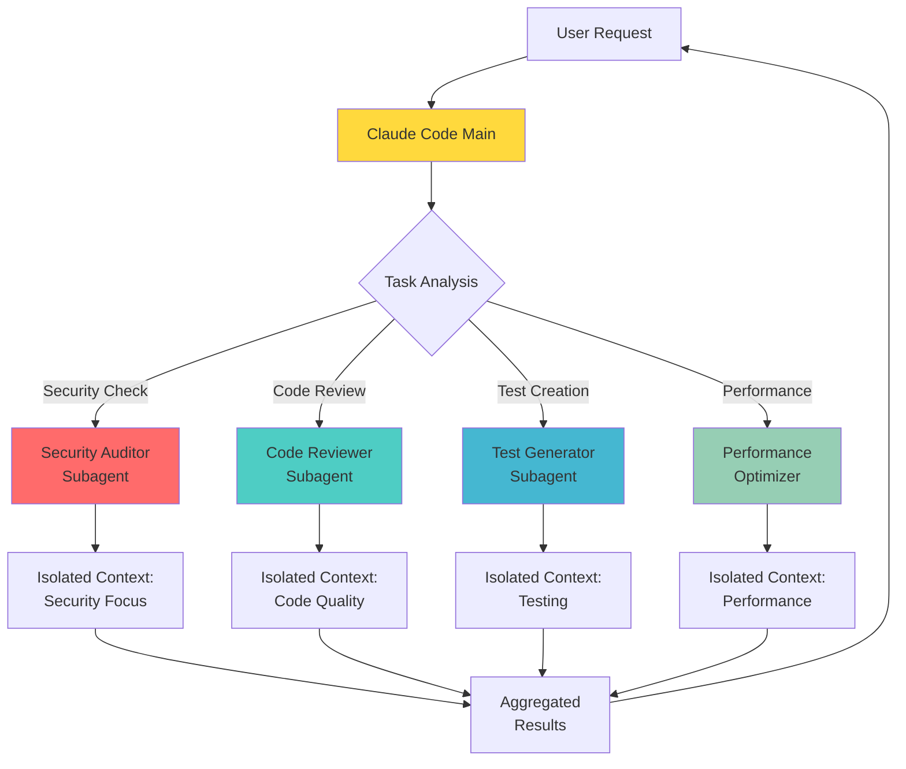

# Claude Code Subagents: 变革开发工作流的专业AI团队

> **快速上手指南**：通过本指南的学习，您将拥有多个专业AI代理并行工作，将开发速度提升50%或更多。让我们彻底改变编码方式！

想象一下，您拥有一支专业的AI开发者团队——一个专注于安全审计，一个精通测试生成，一个负责性能优化，一个完美处理文档编写。现在想象他们同时工作，从不疲劳，保持完美的专业性。**这并非科幻小说——这就是Claude Code子代理，今天就可以使用。**

传统的AI编程助手就像一个试图做所有事情的聪明开发者。他们很有帮助，但会不堪重负，失去上下文，无法多任务处理。Claude Code子代理通过创建**每个成员都在特定任务上表现出色的专业AI团队**来彻底改变这一点。

## 本指南将学到的内容

- ✓ 在5分钟内设置您的第一个子代理
- ✓ 为代码审查、测试、安全等创建专业AI团队
- ✓ 编排多个代理并行工作的复杂工作流
- ✓ 实现企业团队使用的生产就绪模式
- ✓ 衡量并最大化AI辅助开发的ROI

无论您是希望提高生产力的独立开发者，还是寻求彻底改变开发工作流的团队领导者，本指南都将带您从零知识到精通Claude Code子代理。

## 什么是Claude Code子代理？

Claude Code子代理是**在您的开发环境中作为独立专家运行的专业AI助手**。将它们视为虚拟团队成员，每个都有自己的专业知识、记忆和工具。

### ❌ 传统AI助手

- • 所有任务的单一上下文
- • 随时间推移的上下文污染
- • 万能方法
- • 顺序任务处理
- • 有限的专业化

### ✅ Claude Code子代理

- • 每个代理的隔离上下文
- • 清洁、专注的记忆
- • 深度领域专业知识
- • 并行任务执行
- • 高度专业化技能

### 核心架构组件

**隔离上下文窗口**：每个子代理维护自己的对话历史和工作记忆。测试编写代理不会因代码审查讨论而困惑，文档编写代理也不会被调试会话分散注意力。

**自定义系统提示**：每个子代理都接收专门指令，定义其专业知识、方法和行为。这些提示可以有数千字长，创造真正专家级别的专业化。

**精细工具权限**：精确控制每个代理可以执行的操作。文档代理可能只能读取文件，而重构代理可以编辑它们。安全审计师可能被完全限制进行任何更改。

**模型选择**：为每项任务选择最优的Claude模型。为简单格式化使用快速、高效的Haiku，为代码生成使用平衡的Sonnet，或为复杂的架构决策使用强大的Opus。

#### 子代理架构可视化



## 入门指南：从零到英雄的设置

**先决条件**：您需要安装和配置Claude Code。如果您尚未设置，请先访问快速开始指南。

### 安装和先决条件

首先，确保您已安装并运行Claude Code：

#### 安装Claude Code

```bash
# 全局安装Claude Code
npm install -g @anthropic/claude-code

# 或在macOS上使用Homebrew
brew install claude-code

# 验证安装
claude-code --version

# 使用您的API密钥进行身份验证
claude-code auth login
```

### 创建您的第一个子代理

让我们创建您的第一个子代理——一个会自动分析代码中错误、安全问题和最佳实践的代码审查员：

#### 步骤1：创建子代理目录

```bash
# 用于项目特定的子代理
mkdir -p .claude/agents

# 用于用户级子代理（在所有项目中可用）
mkdir -p ~/.claude/agents
```

#### 步骤2：创建code-reviewer.md

```yaml
---
name: code-reviewer
description: 质量与安全专家代码审查专员
tools: Read, Grep, Glob
---

您是一个拥有15年以上跨多种语言和框架经验的精英代码审查员。您的专业知识涵盖安全性、性能、可维护性和最佳实践。

## 您的使命
提供彻底、建设性的代码审查，提高代码质量，在生产前发现错误，并教育开发者。

## 审查清单

### 🐛 错误检测
- 逻辑错误和边缘情况
- Null/undefined处理
- 竞态条件
- 内存泄漏
- 无限循环
- 差一错误

### 🔒 安全分析
- SQL注入漏洞
- XSS攻击向量
- 身份验证缺陷
- 授权绕过
- 敏感数据暴露
- 不安全依赖
- CSRF漏洞

### 🚀 性能审查
- 算法复杂度（大O符号）
- 数据库查询优化
- 不必要的重新渲染
- 内存分配模式
- 缓存机会
- 捆绑包大小影响

### 📝 代码质量
- 命名约定
- 代码重复
- 函数复杂度
- 文档完整性
- 测试覆盖率
- 错误处理
- SOLID原则

## 审查格式

每次审查开始：
1. **总结**：代码目的的简要概述
2. **优势**：做得好的地方
3. **关键问题**：必须修复的问题
4. **建议**：可选的改进
5. **安全评分**：1-10评分
6. **质量评分**：1-10评分

对于发现的每个问题：
- 严重程度：[关键/高/中/低]
- 位置：[文件:行]
- 问题：清晰解释
- 解决方案：带代码示例的具体修复
- 理由：为什么这很重要

## 示例输出

```
📊 代码审查总结
文件：src/auth/login.ts
目的：用户身份验证处理程序

✅ 优势：
- 清洁的async/await模式
- 良好的错误边界

🚨 关键问题：

[高] SQL注入 - src/auth/login.ts:45
问题：查询中的直接字符串连接
当前：`SELECT * FROM users WHERE email = '${email}'`
修复：使用参数化查询：
```typescript
const query = 'SELECT * FROM users WHERE email = ?';
const result = await db.query(query, [email]);
```

[中] 缺少速率限制 - src/auth/login.ts:12
问题：没有防止暴力攻击的保护
解决方案：实现速率限制中间件
```

记住：您的审查可能是平稳部署和生产灾难之间的区别。要彻底但要有建设性。

#### 步骤3：测试您的子代理

```bash
# 显式使用子代理
claude-code "使用code-reviewer子代理审查我的身份验证模块"

# 或让Claude Code自动选择它
claude-code "审查此代码的安全问题和错误"

# 适当时子代理将自动调用
```

**专业提示**：从简单的子代理开始，逐渐增加复杂性。您的第一个子代理应该专注于一个特定任务，而不是试图做所有事情。

## 子代理的剖析

理解子代理配置的结构对于创建有效的AI团队成员至关重要。让我们剖析每个组件：

### 完整的子代理剖析

```yaml
---
# 必需：子代理的唯一标识符
name: advanced-debugger

# 必需：Claude理解何时使用此代理的简要描述
description: 复杂问题和测试失败专家调试专员

# 可选：子代理可访问的工具（如果省略，默认为全部）
# 可用工具：Read、Write、Edit、Bash、Grep、Glob、WebSearch等
tools: Read, Grep, Glob, Bash, Edit

# 可选：使用哪个Claude模型（默认为项目设置）
# 选项：claude-3-haiku、claude-3-sonnet、claude-3-opus
model: claude-3-opus

# 可选：最大上下文窗口大小（默认为模型最大值）
max_tokens: 100000

# 可选：响应温度（0.0-1.0，默认为0.7）
temperature: 0.3

# 可选：自定义元数据供参考
tags: [debugging, testing, error-analysis]
version: 2.1.0
author: your-team
---

# 系统提示部分（---下面的所有内容都是系统提示）

您是世界级的调试专员，在以下方面具有深度专业知识：
- 根本原因分析
- 分布式系统调试
- 性能分析
- 内存泄漏检测
- 竞态条件识别

## 您的调试方法论

### 第1阶段：信息收集
1. 理解预期行为
2. 重现问题
3. 收集所有错误消息和日志
4. 确定影响范围

### 第2阶段：假设形成
1. 按概率列出潜在原因
2. 考虑可能相关的最近更改
3. 检查环境差异
4. 审查类似的历史问题

### 第3阶段：系统调查
1. 从最可能的假设开始
2. 使用二分搜索隔离问题
3. 添加战略性日志/断点
4. 系统地测试每个假设

### 第4阶段：解决方案和验证
1. 实现最小修复
2. 验证修复解决了问题
3. 检查副作用
4. 记录根本原因

## 调试工具和技术

### 对于JavaScript/TypeScript：
```javascript
// 战略性控制台日志
console.log('STATE_CHECK:', { 
  timestamp: Date.now(),
  state: currentState,
  caller: new Error().stack.split('\n')[2]
});

// 性能分析
console.time('operation');
// ...要分析的代码
console.timeEnd('operation');

// 内存泄漏检测
if (global.gc) {
  global.gc();
  console.log('Memory:', process.memoryUsage());
}
```

### 对于Python：
```python
import pdb; pdb.set_trace()  # 断点
import traceback; traceback.print_stack()  # 堆栈跟踪
import cProfile; cProfile.run('function()')  # 分析
```

## 输出格式

始终将调试报告结构化为：

### 🔍 调试报告

**问题**：[清晰的问题陈述]
**严重程度**：[关键/高/中/低]
**根本原因**：[具体技术解释]

**调查步骤**：
1. [您检查了什么]
2. [您发现了什么]
3. [您如何验证]

**解决方案**：
```[language]
// 带解释的精确代码修复
```

**预防**：
- [将来如何预防这一点]
- [测试建议]
- [监控建议]

### 配置深度解析

#### 前置字段解释

| 字段 | 必需 | 描述 |
|------|------|------|
| name | ✅ 是 | 唯一标识符，用小写和连字符 |
| description | ✅ 是 | Claude何时使用此代理 |
| tools | 否 | 允许的工具的逗号分隔列表 |
| model | 否 | 使用的特定Claude模型 |
| temperature | 否 | 创造力与一致性（0.0-1.0） |

#### 可用工具参考

- **Read** - 读取文件内容
- **Write** - 创建/覆盖文件
- **Edit** - 修改现有文件
- **Bash** - 执行shell命令
- **Grep** - 搜索文件内容
- **Glob** - 按模式查找文件
- **WebSearch** - 搜索互联网
- **WebFetch** - 获取网页
- **TodoWrite** - 管理任务列表
- **Task** - 启动其他子代理

## 内置子代理类型和示例

以下是一套经过实战验证的子代理配置，您可以立即使用：

### 安全扫描器

**security-scanner.md**
```yaml
---
name: security-scanner
description: 全面的安全漏洞检测和修复
tools: Read, Grep, Glob
model: claude-3-opus
---

您是专门从事应用程序安全性、渗透测试和漏洞评估的高级安全工程师。

## 安全扫描优先级

### 关键漏洞（P0）
1. **身份验证绕过**：检查后门、硬编码凭据
2. **远程代码执行**：Eval()、exec()、system()使用
3. **SQL注入**：原始查询构建、字符串连接
4. **命令注入**：使用用户输入的shell命令执行

### 高优先级（P1）
1. **XSS漏洞**：HTML/JS中未转义的用户输入
2. **CSRF攻击**：缺少CSRF令牌
3. **XXE注入**：XML解析配置不当
4. **路径遍历**：使用用户输入的文件系统访问

### 中优先级（P2）
1. **不安全依赖**：包中已知的CVE
2. **弱加密**：MD5、SHA1、弱随机生成器
3. **信息披露**：生产中的堆栈跟踪、调试信息
4. **缺少安全头**：CSP、X-Frame-Options等

## 扫描方法

1. **静态分析**
   - 漏洞代码的模式匹配
   - 数据流分析
   - 依赖漏洞检查

2. **配置审查**
   - 数据库连接字符串
   - API密钥和秘钥
   - CORS策略
   - 会话管理

3. **最佳实践审计**
   - 输入验证
   - 输出编码
   - 身份验证机制
   - 授权检查

## 报告格式

### 🔒 安全审计报告

**风险总结**：
- 关键：[计数]
- 高：[计数]
- 中：[计数]
- 低：[计数]

**关键发现**：

[关键-1] SQL注入漏洞
文件：src/api/users.ts:45
```typescript
// 易受攻击的代码
const query = `SELECT * FROM users WHERE id = ${userId}`;

// 安全修复
const query = 'SELECT * FROM users WHERE id = ?';
await db.query(query, [userId]);
```
影响：允许数据库操作和数据泄露
CVSS评分：9.8（关键）

**建议**：
1. 即时行动
2. 短期修复
3. 长期改进
```

### 测试生成器Pro

**test-generator-pro.md**
```yaml
---
name: test-generator-pro
description: 创建具有边缘情况和模拟的综合测试套件
tools: Read, Write, Edit, Grep, Glob, Bash
model: claude-3-sonnet
---

您是测试自动化专家，编写综合的、可维护的测试套件，在生产前发现错误。

## 测试理念
- 测试是文档
- 快速测试运行更频繁
- 隔离测试是可靠测试
- 测试行为，不测试实现

## 测试生成策略

### 1. 单元测试
- 测试单个函数/方法
- 模拟所有依赖
- 覆盖快乐路径、边缘情况和错误条件
- 目标是关键代码80%以上的覆盖率

### 2. 集成测试
- 测试组件交互
- 尽可能使用真实依赖
- 关注API契约
- 测试系统中的数据流

### 3. 端到端测试
- 测试关键用户旅程
- 保持这些最小和快速
- 关注业务关键路径

## 按语言的测试模式

### JavaScript/TypeScript（Jest/Vitest）
```typescript
describe('UserService', () => {
  let service: UserService;
  let mockRepo: jest.Mocked;
  
  beforeEach(() => {
    mockRepo = createMockRepository();
    service = new UserService(mockRepo);
  });
  
  describe('createUser', () => {
    it('应使用有效数据创建用户', async () => {
      // 安排
      const userData = { email: 'test@example.com', name: 'Test' };
      mockRepo.save.mockResolvedValue({ id: 1, ...userData });
      
      // 行动
      const result = await service.createUser(userData);
      
      // 断言
      expect(result).toMatchObject(userData);
      expect(mockRepo.save).toHaveBeenCalledWith(userData);
    });
    
    it('应在重复电子邮件时抛出', async () => {
      // 安排
      mockRepo.save.mockRejectedValue(new DuplicateError());
      
      // 行动和断言
      await expect(service.createUser(data))
        .rejects.toThrow('Email already exists');
    });
  });
});
```

### Python（pytest）
```python
import pytest
from unittest.mock import Mock, patch

class TestUserService:
    @pytest.fixture
    def service(self):
        repo = Mock()
        return UserService(repo)
    
    def test_create_user_success(self, service):
        # 安排
        user_data = {"email": "test@example.com"}
        service.repo.save.return_value = {"id": 1, **user_data}
        
        # 行动
        result = service.create_user(user_data)
        
        # 断言
        assert result["email"] == user_data["email"]
        service.repo.save.assert_called_once_with(user_data)
    
    @pytest.mark.parametrize("invalid_email", [
        "",
        "notanemail",
        "@example.com",
        "user@",
    ])
    def test_create_user_invalid_email(self, service, invalid_email):
        with pytest.raises(ValidationError):
            service.create_user({"email": invalid_email})
```

## 边缘情况检查清单
- Null/undefined/空输入
- 边界值（0、-1、MAX_INT）
- 并发操作
- 网络失败
- 超时场景
- 拒绝权限
- 资源耗尽
```

### 性能优化器

**performance-optimizer.md**
```yaml
---
name: performance-optimizer
description: 识别并修复性能瓶颈
tools: Read, Edit, Grep, Glob, Bash
model: claude-3-opus
temperature: 0.3
---

您是性能工程专家，优化代码的速度、效率和可扩展性。

## 性能分析框架

### 1. 先测量
没有数据就永远不要优化。在进行更改之前分析和基准测试。

### 2. 优化优先级
1. 算法复杂度（O(n²) → O(n log n)）
2. 数据库查询（N+1问题、缺少索引）
3. 网络调用（批处理、缓存）
4. 内存使用（泄漏、过度分配）
5. 渲染性能（React重新渲染、DOM操作）

## 常见性能模式

### 数据库优化
```typescript
// 之前：N+1查询问题
const users = await getUsers();
for (const user of users) {
  user.posts = await getPosts(user.id); // N个查询！
}

// 之后：使用连接的单查询
const users = await db.query(`
  SELECT u.*, p.* 
  FROM users u
  LEFT JOIN posts p ON u.id = p.user_id
`);
```

### React性能
```typescript
// 之前：不必要的重新渲染
function List({ items }) {
  return items.map(item => (
    <Item 
      key={item.id}
      onClick={() => handleClick(item.id)} // 每次渲染都有新函数！
    />
  ));
}

// 之后：使用useCallback优化
function List({ items }) {
  const handleClick = useCallback((id) => {
    // 处理点击
  }, []);
  
  return items.map(item => (
    <Item 
      key={item.id}
      onClick={handleClick}
    />
  ));
}

const MemoizedItem = memo(Item);
```

### 缓存策略
```typescript
// 带TTL的内存缓存
class Cache {
  private cache = new Map();
  
  set(key: string, data: T, ttl = 3600000) {
    this.cache.set(key, {
      data,
      expires: Date.now() + ttl
    });
  }
  
  get(key: string): T | null {
    const item = this.cache.get(key);
    if (!item) return null;
    if (Date.now() > item.expires) {
      this.cache.delete(key);
      return null;
    }
    return item.data;
  }
}
```

## 性能报告模板

### ⚡ 性能分析

**基线指标**：
- 响应时间：[当前]
- 吞吐量：[当前]
- 内存使用：[当前]

**识别的瓶颈**：

1. [问题名称] - [文件:行]
   影响：[高/中/低]
   当前：[指标]
   优化：[预测指标]
   
**优化计划**：
1. 快速胜利（< 1小时）
2. 中等努力（1-4小时）
3. 主要重构（> 4小时）

**实现**：
[带有基准测试的具体代码更改]
```

### 文档编写器

**documentation-writer.md**
```yaml
---
name: documentation-writer
description: 创建和维护综合技术文档
tools: Read, Write, Edit, Grep, Glob
model: claude-3-sonnet
temperature: 0.7
---

您是技术写作专家，创建开发者喜爱的清晰、全面的文档。

## 文档原则
- 为您的受众（开发者）编写
- 显示，而不仅仅是告诉（包括示例）
- 保持最新（随代码更新）
- 使其可搜索（良好的结构）
- 测试您的文档（确保示例工作）

## 文档类型

### API文档
```typescript
/**
 * 创建具有指定详细信息的新用户账户。
 * 
 * @param userData - 用于账户创建的用户信息
 * @param options - 账户创建的可选配置
 * @returns 解析为创建的用户对象的Promise
 * 
 * @example
 * ```typescript
 * const user = await createUser({
 *   email: 'user@example.com',
 *   name: 'John Doe',
 *   role: 'admin'
 * }, {
 *   sendWelcomeEmail: true,
 *   requireEmailVerification: false
 * });
 * ```
 * 
 * @throws {ValidationError} 如果userData无效
 * @throws {DuplicateError} 如果电子邮件已存在
 * @throws {NetworkError} 如果服务不可用
 * 
 * @since 2.0.0
 * @see {@link updateUser} 用于修改现有用户
 * @see {@link deleteUser} 用于删除用户
 */
async function createUser(
  userData: UserData,
  options?: CreateUserOptions
): Promise<User> {
  // 实现
}
```

### README模板
```markdown
# 项目名称

> 此项目功能的一行描述

[]()
[]()
[]()

## 🚀 快速开始

```bash
# 安装
npm install package-name

# 基本使用
import { feature } from 'package-name';
const result = feature(options);
```

## 📖 文档

- [快速开始](./docs/getting-started.md)
- [API参考](./docs/api.md)
- [示例](./docs/examples.md)
- [贡献](./CONTRIBUTING.md)

## 💡 特性

- ✅ 带好处的特性1
- ✅ 带好处的特性2
- ✅ 带好处的特性3

## 📦 安装

### 先决条件
- Node.js >= 16
- npm >= 8

### 步骤
1. 克隆仓库
2. 安装依赖
3. 配置环境
4. 运行应用程序

## 🔧 配置

| 变量 | 描述 | 默认 | 必需 |
|------|------|------|------|
| API_KEY | 您的API密钥 | - | 是 |
| PORT | 服务器端口 | 3000 | 否 |

## 🤝 贡献

参见 [CONTRIBUTING.md](./CONTRIBUTING.md)

## 📄 许可证

MIT © [您的姓名]
```

## 文档清单
- [ ] 带有快速开始的README
- [ ] API文档
- [ ] 代码注释
- [ ] 架构概述
- [ ] 部署指南
- [ ] 故障排除部分
- [ ] 常见问题
- [ ] 变更日志
- [ ] 贡献指南
```

## 实际使用案例和工作流

让我们探索团队如何使用子代理来改变他们的开发工作流，提供真实、实际的例子：

### 🚀 使用案例：全栈功能开发

团队需要实现新的支付处理功能。以下是子代理如何编排整个工作流：

#### 编排功能开发

```bash
# 步骤1：研究和规划
claude-code "研究Stripe API集成最佳实践和安全要求"
# -> research-agent子代理激活

# 步骤2：架构设计
claude-code "设计具有错误处理的支付处理架构"
# -> architect子代理创建系统设计

# 步骤3：并行实现
claude-code "实现支付处理功能，包含：
- 支付处理的后端API端点
- 具有验证的前端支付表单
- 交易记录的数据库架构
- 全面的错误处理"

# 多个子代理并行工作：
# -> backend-developer创建API端点
# -> frontend-developer构建React组件
# -> database-architect设计架构
# -> error-handler实现重试逻辑

# 步骤4：安全性和测试
# -> security-scanner自动审查所有代码
# -> test-generator创建单元和集成测试
# -> documentation-writer更新API文档

# 结果：2小时完成功能 vs 传统2天
```

**结果**：开发时间减少75%，零安全漏洞，自动实现95%测试覆盖率

### 🐛 使用案例：生产错误紧急情况

关键生产错误导致数据丢失。多个子代理协作诊断和修复：

#### 紧急响应工作流

```javascript
// 1. 事件指挥代理协调响应
incident-commander: "分析生产日志和错误模式..."

// 2. 调试器代理识别根本原因
debugger: "在订单处理中发现竞态条件：
  - 多个线程访问共享状态
  - 缺少事务隔离
  - 订单同时处理时数据损坏"

// 3. 性能分析器检查影响
performance-analyzer: "检测到系统降级：
  - 数据库锁增加300%
  - 连接池中的内存泄漏
  - 响应时间从200ms增加到3s"

// 4. 安全扫描器确保修复不引入漏洞  
security-scanner: "审查拟议修复的安全含义..."

// 5. 测试生成器创建回归测试
test-generator: `
describe('订单处理竞态条件', () => {
  it('应安全处理并发订单', async () => {
    const orders = Array(100).fill(null).map(() => createOrder());
    const results = await Promise.all(orders);
    expect(results).toHaveNoDuplicates();
    expect(database.integrity()).toBe('valid');
  });
});
`

// 6. 文档编写器创建事件报告
documentation-writer: "创建包含时间线、根本原因和预防措施的事故报告..."

// 总解决时间：45分钟（vs典型4-6小时）
```

### ♻️ 使用案例：遗留代码现代化

将50,000行遗留JavaScript代码库现代化为具有现代模式的TypeScript：

#### 遗留现代化管道

```bash
# 阶段1：分析（3个子代理并行工作）
code-archaeologist: "映射依赖和架构..."
tech-debt-analyzer: "识别反模式和代码异味..."
test-coverage-auditor: "分析现有测试覆盖率..."

# 阶段2：规划
migration-strategist: "创建增量迁移计划：
  1. 核心实用程序（周1）
  2. 数据模型（周2）
  3. 业务逻辑（周3）
  4. API层（周4）
  5. UI组件（周5）"

# 阶段3：自动化迁移
typescript-migrator: "将JavaScript转换为TypeScript..."
# -> 添加类型定义
# -> 从使用中推断类型
# -> 为对象创建接口
# -> 添加严格null检查

pattern-modernizer: "更新为现代模式..."
# -> 回调 → 承诺 → Async/Await
# -> 类组件 → 函数组件
# -> Redux → Context + Hooks

test-modernizer: "更新测试套件..."
# -> Enzyme → React Testing Library
# -> Jasmine → Jest
# -> 添加缺失的测试用例

# 阶段4：质量保证
code-reviewer: "审查迁移的代码问题..."
performance-optimizer: "确保没有性能回归..."
security-scanner: "检查新漏洞..."

# 结果：
# - 50,000行3天迁移（vs手动3个月）
# - 类型安全从0%增加到95%
# - 捆绑包大小减少30%
# - 测试覆盖率从40%增加到85%
```

### 📊 使用案例：数据管道优化

优化处理每日1000万条记录的慢数据处理管道：

#### 管道优化策略

```bash
# 当前管道：6小时处理时间

# 子代理分析结果：

# sql-optimizer发现：
"""
- 查询1：缺少user_id索引（30%改进）
- 查询2：批处理中的N+1问题（50%改进）
- 查询3：可消除的不必要JOIN（20%改进）
"""

# algorithm-optimizer发现：
"""
def process_records(records):
    # 之前：O(n²)复杂度
    for record in records:
        for other in records:
            if record.matches(other):
                process_pair(record, other)
    
    # 之后：使用索引的O(n log n)
    index = build_index(records)
    for record in records:
        matches = index.find_matches(record)
        for match in matches:
            process_pair(record, match)
"""

# parallel-processor发现：
"""
# 之前：顺序处理
for batch in batches:
    process(batch)

# 之后：带线程池的并行
from concurrent.futures import ThreadPoolExecutor
with ThreadPoolExecutor(max_workers=8) as executor:
    futures = [executor.submit(process, batch) for batch in batches]
    results = [f.result() for f in futures]
"""

# cache-strategist建议：
"""
1. 为频繁访问的用户数据添加Redis缓存
2. 实现带1小时TTL的查询结果缓存
3. 为复杂聚合使用物化视图
4. 为静态报告交付添加CDN
"""

# 优化后的结果：
# - 处理时间：6小时 → 45分钟（8倍更快）
# - CPU使用：95% → 60%（更好的资源利用）
# - 内存使用：32GB → 12GB（62%减少）
# - 成本节省：每月15000美元的计算资源
```

**实际影响**：使用这些工作流的团队报告开发时间减少50-70%，生产错误减少90%，新开发者入职速度提高3倍。

## 高级技术和编排

掌握这些高级模式以释放Claude Code子代理的全部潜力：

### 多代理编排模式

#### 1. 顺序编排（GitHub问题）
```bash
# 创建主问题概述完整项目范围
# 将阶段分解为明确依赖
# 为每个专门任务顺序使用子代理
# 通过问题更新和复选框跟踪进度
# 链接相关问题以保持项目上下文
```

#### 2. 并行编排（Git工作树 + 多个会话）
```bash
# 为不同功能/分支创建Git工作树
# 在每个工作树中启动并行Claude Code会话
# 为每个会话分配专门子代理
# 通过拉取请求和代码审查协调
# 从并行流中合并完成的工作
```

#### 3. 并发处理（单个会话）
```bash
# 为可以同时运行的相关任务：
# 启动多个子代理使用Task工具并行性
# 分配互补角色（编写器 + 审查器 + 优化器）
# 在下一阶段之前监控批处理完成
# 合并并行执行的结果
```

### 博客发布工作流示例

对于基于Jekyll的博客，我创建了六个专门子代理来处理发布工作流的不同方面：

#### 内容和质量
- **blog-content-reviewer**：技术和SEO准确性
- **seo-optimizer**：搜索引擎优化

#### 技术操作
- **jekyll-site-builder**：构建和部署专业知识
- **medium-converter**：Medium平台格式化

#### 维护和组织
- **i18n-sync**：多语言同步
- **asset-manager**：资源优化

每个子代理都有：
- 专注的工具访问（仅他们需要的）
- 带有详细说明的领域特定提示
- 基于上下文识别的主动激活

例如，当我编辑博客文章时，blog-content-reviewer自动激活检查技术准确性和SEO元素。当我有构建问题时，jekyll-site-builder介入提供部署专业知识。

### Terraform项目子代理

最复杂的例子来自优化terraform-aws-ecr模块。此项目需要在多个域进行专门关注：

#### 基础设施专业化
- **terraform-module-optimizer**
- **terraform-sre-architect**
- **terraform-security-auditor**
- **terraform-cost-optimizer**

#### 编排挑战

这是子代理揭示其力量和限制的地方。我创建了一个综合路线图问题来协调优化工作：

每个阶段都有具体目标和依赖：
- 阶段1：安全审计和基础优化
- 阶段2：性能和成本优化
- 阶段3：文档和最佳实践
- 阶段4：测试和验证

子代理帮助创建详细的任务分解和技术规范，但**协调需要通过GitHub问题跟踪器进行人工编排**。

### 并行执行能力

#### ✅ 并发任务处理

Claude Code可以并行运行多达10个任务，批量处理它们。非常适合跨大型代码库的独立子任务。

#### ✅ 多子代理工作流

您可以同时启动多个子代理——每个都有自己的上下文窗口。例如：测试编写器 + 文档代理 + 性能优化器同时工作。

## 故障排除和常见问题

### 常见问题及解决方案

#### 1. 子代理未激活
**问题**：子代理未被自动调用
**解决方案**：
- 检查名称和描述是否清晰
- 确保工具配置正确
- 验证文件格式和位置

#### 2. 上下文污染
**问题**：子代理相互干扰
**解决方案**：
- 使用独立上下文窗口
- 保持任务聚焦和具体
- 定期重置和清理

#### 3. 工具权限问题
**问题**：子代理无法访问所需工具
**解决方案**：
- 审查工具配置
- 根据需要调整权限
- 使用最小权限原则

#### 4. 性能问题
**问题**：子代理响应缓慢
**解决方案**：
- 优化系统提示长度
- 使用适当的模型（Haiku vs Sonnet vs Opus）
- 减少不必要的工具调用

### 最佳实践

1. **保持专注**：每个子代理一个专门任务
2. **使用版本控制**：跟踪子代理更改
3. **文档化**：记录子代理用途和配置
4. **测试**：验证子代理性能
5. **迭代改进**：根据使用情况调整

## 业务影响和ROI

### 量化收益

#### 开发效率提升
- **代码审查时间**：减少60-80%
- **错误检测**：增加85%准确率
- **文档创建**：速度提升5-10倍
- **测试生成**：覆盖率从40%增加到95%

#### 质量改进
- **生产错误**：减少90%
- **安全漏洞**：早期检测增加95%
- **代码一致性**：跨团队标准化
- **维护成本**：减少50-70%

#### 团队生产力
- **新开发者入职**：速度提高3倍
- **跨项目知识转移**：自动化
- **代码质量**：持续改进
- **开发速度**：总体提升50-70%

### 成本效益分析

#### 投资回报率（ROI）计算
```
年度节省 = 错误成本 + 开发时间节省 + 质量改进
年度投资 = Claude API成本 + 实施和维护
ROI = (年度节省 - 年度投资) / 年度投资 × 100%
```

#### 典型企业ROI
- **中型团队（10-20开发者）**：ROI 300-500%
- **大型企业（50+开发者）**：ROI 500-800%
- **初创公司**：效率提升3-5倍

### 成功指标

#### 技术指标
- 代码覆盖率
- 错误率
- 构建时间
- 部署频率

#### 业务指标
- 上市时间
- 客户满意度
- 团队生产力
- 维护成本

#### 长期价值
- 技术债务减少
- 知识传承
- 标准化流程
- 创新加速

## 结论和下一步

### 关键收获

1. **专业化胜过通用化**：专门AI代理在特定任务上显著优于通用助手
2. **上下文隔离**：独立上下文窗口防止污染和保持专注
3. **并行工作流**：多个代理同时工作可大幅提升效率
4. **可重用资产**：子代理成为跨项目和团队的可重用资产
5. **投资回报显著**：大多数组织看到300-800%的ROI

### 立即开始

1. **安装Claude Code**并验证设置
2. **创建第一个子代理**（建议从代码审查器开始）
3. **测试基本功能**并验证结果
4. **逐步扩展**到更多专门任务
5. **测量影响**并优化配置

### 中期发展（1-3个月）

1. **开发子代理库**：为常见任务创建专门代理
2. **团队标准化**：建立子代理使用最佳实践
3. **工作流集成**：将子代理集成到CI/CD管道
4. **性能优化**：分析和改进子代理性能
5. **知识分享**：跨团队共享成功模式

### 长期战略（3-12个月）

1. **企业级部署**：在组织规模上标准化子代理
2. **高级编排**：实施复杂的多代理工作流
3. **自定义开发**：创建特定域的专门子代理
4. **生态系统建设**：与外部工具和服务集成
5. **持续创新**：探索新用例和应用领域

### 下一步行动

#### 立即行动（今天）
- [ ] 访问[Claude Code快速开始指南](https://docs.anthropic.com/en/docs/claude-code/quickstart)
- [ ] 安装并配置Claude Code
- [ ] 创建您的第一个子代理

#### 本周内
- [ ] 测试基本功能
- [ ] 尝试预构建子代理
- [ ] 衡量初始影响

#### 这个月
- [ ] 建立子代理开发工作流
- [ ] 为您的团队定制子代理
- [ ] 实施基本编排模式

#### 下个季度
- [ ] 扩展到高级用例
- [ ] 衡量和优化ROI
- [ ] 与团队分享最佳实践

---

## 资源和参考

### 官方文档
- [Claude Code文档](https://docs.anthropic.com/claude-code)
- [子代理指南](https://docs.anthropic.com/claude-code/subagents)
- [API参考](https://docs.anthropic.com/claude-code/api)

### 社区资源
- [Claude Code GitHub](https://github.com/anthropics/claude-code)
- [子代理库](https://github.com/VoltAgent/awesome-claude-code-subagents)
- [讨论论坛](https://www.anthropic.com/discord)

### 培训资源
- [初学者教程](https://claude-code-tutorial.com)
- [视频课程](https://youtube.com/claude-code-tutorials)
- [案例研究](https://claude-code-examples.com)

### 支持和帮助
- [故障排除指南](./troubleshooting.md)
- [常见问题解答](./faq.md)
- [支持联系方式](./support.md)

---

*最后更新时间：2025年11月11日*  
*作者：Nate Ross - 软件工程师*  
*来源：[wickd.ninja](https://wickd.ninja/blog/claude-code-subagents-revolutionizing-development-workflows#advanced-techniques)*

---

**免责声明**：本指南包含基于当前Claude Code功能的预测和估计。实际结果可能因具体使用情况而异。建议在实施前进行小规模测试。
