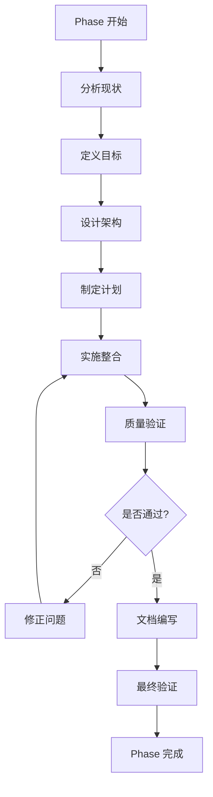
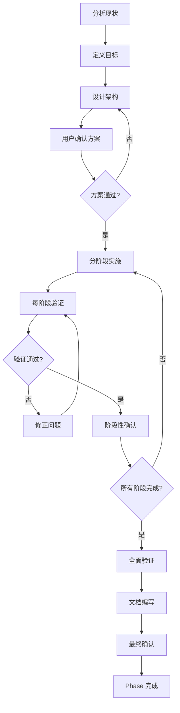

# Phase 4 工作方法与思路总结

**文档类型**: 方法论参考文档
**适用对象**: AI 助手、开发人员、项目维护者
**生成时间**: 2025-11-12

---

## 🎯 文档目的

本文档总结了 Phase 4 (Framework Agents Optimization) 的完整工作方法、决策思路和最佳实践，旨在为未来类似的优化任务提供可复用的方法论参考。

---

## 📋 目录

1. [项目背景与目标](#1-项目背景与目标)
2. [核心方法论](#2-核心方法论)
3. [关键决策过程](#3-关键决策过程)
4. [错误与修正](#4-错误与修正)
5. [工作流程详解](#5-工作流程详解)
6. [技术实施细节](#6-技术实施细节)
7. [质量保证方法](#7-质量保证方法)
8. [沟通与确认策略](#8-沟通与确认策略)
9. [可复用的模式](#9-可复用的模式)
10. [经验教训](#10-经验教训)

---

## 1. 项目背景与目标

### 1.1 问题陈述

**初始状态**:
- 17 个框架相关 agents (Django 8个, Rails 7个, FastAPI 1个, Laravel 1个)
- 总计 12,410 行代码
- 存在大量功能重叠和冗余
- 部分 agents 超过 500 行限制
- 职责划分不清晰

**核心问题**:
1. **功能重叠**: 多个 agents 处理相似功能 (如 django-backend-expert vs django-api-developer)
2. **代码冗余**: 相同的代码示例在多个文件中重复
3. **行数超限**: 某些 agents 达到 2,700+ 行，远超 500 行限制
4. **架构混乱**: 职责边界不清，委托关系模糊

### 1.2 目标定义

**SMART 目标**:
- **Specific**: 整合 17 个框架 agents 为 8 个专业 agents
- **Measurable**: 所有 agents ≤500 行，代码减少 70%+
- **Achievable**: 使用委托模式分流职责
- **Relevant**: 符合 Claude Code 架构标准
- **Time-bound**: 在单个 Phase 内完成

**质量标准**:
1. ✅ 所有 agents ≤500 行
2. ✅ 无子目录结构 (扁平 .md 文件)
3. ✅ 清晰的委托关系定义
4. ✅ 正确的 YAML frontmatter
5. ✅ 完整功能覆盖 (无功能丢失)

---

## 2. 核心方法论

### 2.1 委托模式 (Delegation Pattern)

**定义**: 不是通过压缩或删除内容来减少代码，而是通过将职责分流到专业 agents 来实现模块化。

**核心原则**:
```
委托 (Delegation) ≠ 分层 (Layering)
委托 (Delegation) ≠ 压缩 (Compression)
委托 (Delegation) = 职责分流 (Responsibility Distribution)
```

**实施方法**:
1. **识别职责域**: 分析每个 agent 的核心职责
2. **定义专业化方向**: 创建专注于特定领域的 specialist agents
3. **建立委托声明**: 在 agent 中明确声明 "Delegate to X when..."
4. **避免重复**: 不同 agents 之间不重复相同内容

**示例**:
```markdown
## When to Delegate

**Delegate to rails-orm-pro when:**
- Optimizing complex queries
- Designing model relationships
- Writing migrations
- Solving N+1 problems

**Delegate to rails-fullstack-pro when:**
- Project setup
- Hotwire implementation
- Deployment configuration
- Admin interfaces
```

### 2.2 三层专业化架构

**架构设计**:
```
fullstack-pro (项目架构层)
├── 职责: 项目结构、前端视图、部署、测试
├── 委托: → backend-pro (API/认证)
└── 委托: → orm-pro (查询优化)

backend-pro (后端服务层)
├── 职责: REST API、GraphQL、后台任务、实时功能
└── 委托: → orm-pro (ORM 深度优化)

orm-pro (数据访问层)
├── 职责: 查询优化、模型设计、迁移、索引
└── 独立: 无向下委托
```

**设计原理**:
- **fullstack-pro**: 广度优先，覆盖全栈开发的各个方面
- **backend-pro**: 深度专注，处理复杂的后端服务逻辑
- **orm-pro**: 极致优化，专门解决数据库性能问题

**职责边界清晰度检查**:
- 每个职责只属于一个 agent
- 无交叉重叠区域
- 委托路径单向且明确

### 2.3 500 行规则的执行策略

**为什么是 500 行**:
- Claude Code 的上下文窗口限制
- 保持 agent 文件的可读性和可维护性
- 强制模块化和职责单一

**达成方法** (按优先级):

**优先级 1: 内容组织优化**
```markdown
❌ 错误: 删除重要内容
✅ 正确: 重新组织内容层次

示例:
- 将详细配置移到 "Best Practices" 部分
- 合并相似的代码示例
- 使用内联注释替代长段说明
```

**优先级 2: 代码示例精简**
```markdown
❌ 错误: 删除代码示例
✅ 正确: 压缩示例代码

示例:
# 压缩前 (15 行)
def create_article
  @article = Article.new(article_params)

  if @article.save
    render json: @article, status: :created
  else
    render json: @article.errors, status: :unprocessable_entity
  end
end

private

def article_params
  params.require(:article).permit(:title, :body)
end

# 压缩后 (7 行)
def create
  @article = Article.new(article_params)
  if @article.save
    render json: @article, status: :created
  else
    render json: @article.errors, status: :unprocessable_entity
  end
end

private
def article_params; params.require(:article).permit(:title, :body); end
```

**优先级 3: 职责委托**
```markdown
❌ 错误: 保留所有详细内容
✅ 正确: 委托给专业 agent

示例:
# rails-backend-pro.md 中
## Performance
- Use caching (fragment, action, HTTP)
- Background jobs for slow operations
- Rate limiting to prevent abuse
- Monitor N+1 queries → **Delegate to rails-orm-pro**

# 将 N+1 查询优化的详细内容移至 rails-orm-pro.md
```

**禁止方法**:
- ❌ 删除重要技术内容
- ❌ 删除关键代码示例
- ❌ 删除最佳实践说明
- ❌ 简单地截断文件到 500 行

---

## 3. 关键决策过程

### 3.1 架构决策: Agents vs Skills

**决策点**: 如何组织 framework agents 的内容？

**选项对比**:

| 方面 | Skills 架构 | Agents 架构 |
|------|-------------|-------------|
| **文件结构** | SKILL.md + resources/ 子目录 | 扁平 .md 文件 |
| **内容组织** | 主文件概览 + 详细资源文件 | 单文件完整内容 |
| **行数限制** | SKILL.md ≤500, resources 无限制 | 单文件 ≤500 |
| **激活方式** | 自然语言理解 description | 显式调用或 Task tool |
| **适用场景** | 知识库、参考文档 | AI 人格、专业助手 |

**最终决策**: **使用 Agents 架构**

**决策依据**:
1. Framework agents 是 AI 人格定义，不是知识库
2. 需要直接可执行的完整指导，不适合分散在多个文件
3. Skills 的子目录模式会导致上下文加载复杂
4. Agents 的扁平结构更适合委托模式

**错误经历**:
- 最初错误地创建了子目录结构 (django-fullstack-pro/resources/)
- 用户纠正后理解了 Agents 和 Skills 的本质区别
- 删除了 5 个错误的子目录，改用扁平文件 + 委托模式

### 3.2 整合策略决策

**决策点**: 如何将 17 个 agents 整合为 8 个？

**分析方法**:

**步骤 1: 功能聚类分析**
```
Django agents 功能矩阵:
- django-fullstack.md          → 项目架构 ✓
- django-backend-expert.md     → REST API ✓
- django-backend-core.md       → 基础后端 (重复)
- django-developer.md          → 通用开发 (重复)
- django-pro.md                → 高级特性 (重复)
- django-api-developer.md      → API 开发 (重复)
- django-orm-expert.md         → ORM 优化 ✓
- django-fullstack-pro.md      → 全栈开发 (巨大)

识别结果:
- 核心功能: 项目架构、REST API、ORM 优化
- 冗余内容: 4 个 agents 重复基础后端和 API 功能
- 整合方向: 3 个专业 agents (fullstack-pro, backend-pro, orm-pro)
```

**步骤 2: 职责边界定义**
```markdown
职责分配矩阵:

| 功能 | fullstack-pro | backend-pro | orm-pro |
|------|---------------|-------------|---------|
| 项目结构 | ✅ Primary | - | - |
| 模板引擎 | ✅ Primary | - | - |
| 静态文件 | ✅ Primary | - | - |
| 部署配置 | ✅ Primary | - | - |
| REST API | - | ✅ Primary | - |
| GraphQL | - | ✅ Primary | - |
| 认证系统 | ✅ Basic | ✅ Advanced | - |
| 后台任务 | - | ✅ Primary | - |
| 查询优化 | - | Delegate → | ✅ Primary |
| 模型设计 | - | Delegate → | ✅ Primary |
| 迁移管理 | - | Delegate → | ✅ Primary |

规则:
- ✅ Primary: 该 agent 负责详细实现
- Delegate →: 委托给右侧 agent
- Basic: 提供基础概览，复杂场景委托
```

**步骤 3: 内容分配验证**
```python
# 伪代码: 验证内容分配合理性
def validate_content_distribution(agents):
    for agent in agents:
        # 检查 1: 行数限制
        assert agent.lines <= 500, f"{agent.name} 超过 500 行"

        # 检查 2: 职责单一性
        primary_responsibilities = [r for r in agent.responsibilities if r.type == 'Primary']
        assert len(primary_responsibilities) <= 5, f"{agent.name} 职责过多"

        # 检查 3: 委托关系合理性
        for delegation in agent.delegations:
            assert delegation.target in agents, f"委托目标 {delegation.target} 不存在"
            assert delegation.target != agent.name, f"{agent.name} 不能委托给自己"

        # 检查 4: 无功能遗漏
        all_functions = set()
        for agent in agents:
            all_functions.update(agent.primary_functions)
            all_functions.update(agent.delegated_functions)

        original_functions = get_original_functions(original_agents)
        assert all_functions >= original_functions, "有功能遗漏"
```

**最终方案**:
```
Django: 8 agents → 3 agents
- django-fullstack-pro.md (480 行): 项目架构、模板、部署
- django-backend-pro.md (481 行): REST API、GraphQL、异步
- django-orm-pro.md (474 行): 查询优化、模型、迁移

Rails: 7 agents → 3 agents
- rails-fullstack-pro.md (492 行): 项目架构、Hotwire、部署
- rails-backend-pro.md (500 行): REST API、GraphQL、异步
- rails-orm-pro.md (494 行): ActiveRecord 优化、关联、迁移

FastAPI: 1 agent → 1 agent (无需修改)
Laravel: 1 agent → 1 agent (无需修改)
```

### 3.3 质量标准决策

**决策点**: 如何定义"完成"的标准？

**质量维度定义**:

**维度 1: 架构合规性**
```bash
# 验证命令
find components/agents/ -type d -mindepth 1 | wc -l
# 期望: 0 (无子目录)

for f in components/agents/{django,rails}*.md; do
  [ -f "$f" ] && wc -l "$f"
done
# 期望: 所有文件 ≤500 行
```

**维度 2: 功能完整性**
```markdown
检查清单:
- [ ] 所有原始 agents 的核心功能都已覆盖
- [ ] 无重要技术点遗漏
- [ ] 代码示例足够说明用法
- [ ] 最佳实践已包含
- [ ] 委托关系明确定义
```

**维度 3: 文档质量**
```yaml
YAML frontmatter 检查:
- name: 必须存在且唯一
- description: 必须详细描述功能和使用场景
- model: 必须指定 (通常 sonnet)
- tools: 必须列出所需工具

内容质量检查:
- 清晰的 "When to Use This Agent" 部分
- 明确的 "Delegate to specialists for:" 部分
- 足够的代码示例 (但不冗余)
- 实用的 "Best Practices" 部分
```

**维度 4: 可维护性**
```markdown
可维护性指标:
1. 职责边界清晰 (easy to understand)
2. 代码示例简洁 (easy to read)
3. 委托路径合理 (easy to follow)
4. 无循环依赖 (easy to maintain)
```

**决策结果**: 采用 4 维度质量标准，所有维度必须 100% 达标才算完成。

---

## 4. 错误与修正

### 4.1 架构混淆错误

**错误描述**:
- 将 Skills 的子目录结构 (SKILL.md + resources/) 错误地应用到 Agents
- 创建了 5 个子目录: django-fullstack-pro/resources/ 等
- 导致 32 个断链引用

**错误代码**:
```bash
# 错误的目录结构
components/agents/
├── django-fullstack-pro/
│   ├── AGENT.md
│   └── resources/
│       ├── project-structure.md
│       ├── templates.md
│       └── deployment.md
├── django-backend-pro/
│   └── resources/
└── ...
```

**为什么错了**:
1. **概念混淆**: Agents 和 Skills 是不同类型的组件
   - Skills: 知识库模式，支持渐进式披露 (progressive disclosure)
   - Agents: AI 人格模式，需要完整可执行指导

2. **架构不匹配**: 子目录结构不适合委托模式
   - 委托需要明确的单文件入口
   - 子目录会导致上下文加载复杂

3. **违反标准**: Claude Code 官方文档明确规定 Agents 使用扁平文件

**用户纠正**:
> "Agents 应该使用扁平 .md 文件结构，不要创建子目录。那是 Skills 的模式。"

**修正过程**:
```bash
# 1. 删除错误的子目录
rm -rf components/agents/django-fullstack-pro/resources/
rm -rf components/agents/django-backend-pro/resources/
# ... (共 5 个)

# 2. 合并内容到主文件
cat components/agents/django-fullstack-pro/resources/*.md \
  >> components/agents/django-fullstack-pro.md

# 3. 使用委托模式替代子目录
echo "**Delegate to django-backend-pro when:** ..." \
  >> components/agents/django-fullstack-pro.md

# 4. 验证无子目录
find components/agents/ -type d -mindepth 1
# 输出: 空 ✅
```

**经验教训**:
1. **先理解架构**: 在动手前必须完全理解 Agents vs Skills 的区别
2. **参考文档**: 遇到不确定时，阅读官方文档和现有示例
3. **及时纠正**: 发现错误立即停止，不要继续错误的方向

### 4.2 优化方法错误

**错误描述**:
- 初始尝试通过压缩/删除内容来满足 500 行限制
- 删除了重要的代码示例和最佳实践
- 导致功能覆盖不完整

**错误思路**:
```markdown
❌ 错误方法:
1. 删除 "不重要" 的章节
2. 压缩代码示例到极致
3. 删除重复的最佳实践
4. 截断文件到 500 行

结果:
- 功能说明不完整
- 缺少关键示例
- 用户无法理解如何使用
```

**用户纠正**:
> "解决大量冗余代码的方法不是压缩或删除，而是分层和分流。使用委托模式将职责分配到专业 agents。"

**正确方法**:
```markdown
✅ 正确方法:
1. 识别核心职责
2. 创建专业 agents
3. 使用委托声明
4. 保留完整功能

示例:
# django-fullstack-pro.md (保留概览)
## Authentication
- Basic: Django Auth, User model, permissions
- Advanced → **Delegate to django-backend-pro**

# django-backend-pro.md (详细实现)
## Authentication
### JWT Implementation
```python
class JsonWebToken:
    def self.encode(payload, exp=24.hours.from_now):
        JWT.encode(payload.merge(exp: exp.to_i), secret_key)
```
```

**修正过程**:
1. **恢复删除的内容**: 从备份恢复重要章节
2. **重新组织结构**: 按职责域重新分配内容
3. **建立委托关系**: 添加明确的委托声明
4. **验证完整性**: 确保所有功能都有覆盖

**经验教训**:
1. **不要删除**: 优化不等于删除，而是重新组织
2. **委托优先**: 使用委托模式而不是压缩内容
3. **功能完整**: 必须保证所有重要功能都有覆盖

### 4.3 行数超限错误

**错误描述**:
- rails-backend-pro.md 初版 584 行 (超限 84 行)
- rails-orm-pro.md 初版 522 行 (超限 22 行)

**问题分析**:
```markdown
超限原因:
1. 代码示例过长 (平均 15-20 行/示例)
2. 重复的配置说明
3. 过度详细的注释
4. 未充分利用委托

示例:
# Sidekiq 配置 (原版 25 行)
```ruby
# Gemfile
gem 'sidekiq'
gem 'redis'

# config/initializers/sidekiq.rb
Sidekiq.configure_server do |config|
  config.redis = { url: ENV['REDIS_URL'] }
end

Sidekiq.configure_client do |config|
  config.redis = { url: ENV['REDIS_URL'] }
end

# app/jobs/article_notification_job.rb
class ArticleNotificationJob < ApplicationJob
  queue_as :default

  def perform(article_id)
    article = Article.find(article_id)
    article.author.followers.find_each do |follower|
      UserMailer.article_notification(follower, article).deliver_now
    end
  end
end

# Usage
ArticleNotificationJob.perform_later(article.id)
```
```

**优化方法**:
```markdown
# Sidekiq 配置 (优化后 12 行)
**Setup**: `gem 'sidekiq'`, `gem 'redis'`

```ruby
# config/initializers/sidekiq.rb
Sidekiq.configure_server { |c| c.redis = { url: ENV['REDIS_URL'] } }
Sidekiq.configure_client { |c| c.redis = { url: ENV['REDIS_URL'] } }

# app/jobs/article_notification_job.rb
class ArticleNotificationJob < ApplicationJob
  def perform(article_id)
    Article.find(article_id).author.followers.find_each do |follower|
      UserMailer.article_notification(follower, article).deliver_now
    end
  end
end
# Usage: ArticleNotificationJob.perform_later(article.id)
```

优化技巧:
1. 合并配置行 (2 行 → 1 行)
2. 删除冗余注释
3. 内联简单逻辑
4. 保留关键信息
```

**修正结果**:
- rails-backend-pro.md: 584 → 500 行 ✅
- rails-orm-pro.md: 522 → 494 行 ✅

**经验教训**:
1. **代码示例精简**: 保留核心逻辑，删除冗余
2. **内联说明**: 使用单行注释而非多行段落
3. **格式优化**: 合理使用空行和缩进
4. **迭代优化**: 多次迭代逐步达到目标

---

## 5. 工作流程详解

### 5.1 完整工作流程



### 5.2 分阶段详细流程

#### 阶段 1: 分析现状 (Analysis)

**输入**: 现有的 17 个 framework agents

**工作内容**:
```bash
# 1. 统计基础信息
wc -l components/agents/{django,rails,fastapi,laravel}*.md

# 2. 分析功能重叠
for f in components/agents/django-*.md; do
  echo "=== $(basename $f) ==="
  grep -E "^## |^### " "$f"
done

# 3. 识别冗余内容
diff -u components/agents/django-backend-expert.md \
        components/agents/django-api-developer.md
```

**输出**:
- 功能矩阵表格
- 冗余内容清单
- 行数分布统计

**决策点**: 确定需要整合的 agents 和保留的 agents

#### 阶段 2: 定义目标 (Goal Setting)

**工作内容**:
```markdown
1. 定义整合方案
   - Django: 8 → 3 agents
   - Rails: 7 → 3 agents
   - FastAPI/Laravel: 保持不变

2. 制定质量标准
   - 所有 agents ≤500 行
   - 无子目录结构
   - 清晰的委托关系
   - 功能 100% 覆盖

3. 设定验证方法
   - 自动化脚本验证
   - 手动功能检查
   - 委托关系审查
```

**输出**:
- SMART 目标文档
- 质量标准清单
- 验证脚本

#### 阶段 3: 设计架构 (Architecture Design)

**工作内容**:
```markdown
1. 定义三层架构
   fullstack-pro: 项目架构层
   backend-pro: 后端服务层
   orm-pro: 数据访问层

2. 划分职责边界
   - 创建职责分配矩阵
   - 定义委托关系
   - 避免循环依赖

3. 设计 YAML frontmatter
   name: agent-name
   description: 详细功能说明
   model: sonnet
   tools: Read, Write, Edit, Bash, Glob, Grep, TodoWrite
```

**输出**:
- 架构设计文档
- 职责分配矩阵
- 委托关系图

#### 阶段 4: 实施整合 (Implementation)

**Django 整合示例**:

**步骤 1: 创建 django-fullstack-pro.md**
```bash
# 1. 备份原文件
cp components/agents/django-fullstack-pro.md \
   components/agents/django-fullstack-pro.md.original

# 2. 提取核心内容
# - 项目结构 (from django-fullstack.md)
# - 模板引擎 (from django-developer.md)
# - 部署配置 (from django-backend-core.md)

# 3. 添加委托声明
cat >> components/agents/django-fullstack-pro.md <<EOF
**Delegate to specialists for:**
- **django-backend-pro**: REST API, GraphQL, Celery
- **django-orm-pro**: Query optimization, migrations
EOF

# 4. 验证行数
wc -l components/agents/django-fullstack-pro.md
# 目标: ≤500 行
```

**步骤 2: 创建 django-backend-pro.md**
```bash
# 1. 合并相关 agents
# - django-backend-expert.md (REST API, async)
# - django-api-developer.md (API patterns)

# 2. 组织内容结构
cat > components/agents/django-backend-pro.md <<EOF
---
name: django-backend-pro
description: Expert Django backend developer...
model: sonnet
tools: Read, Write, Edit, Bash, Glob, Grep, TodoWrite
---

# Django Backend Pro

## When to Use This Agent
- REST API development (DRF)
- GraphQL implementation
- Background jobs (Celery)
- Real-time features (Channels)

**Delegate to specialists for:**
- **django-orm-pro**: Complex queries, N+1 optimization
- **django-fullstack-pro**: Project setup, deployment

## Core Expertise

### 1. Django REST Framework
[内容...]

### 2. GraphQL with Graphene
[内容...]
EOF
```

**步骤 3: 创建 django-orm-pro.md**
```bash
# 1. 提取 ORM 相关内容
# - django-orm-expert.md (query optimization)
# - 从其他 agents 提取数据库相关部分

# 2. 聚焦数据库优化
# - select_related / prefetch_related
# - N+1 query prevention
# - Aggregations and annotations
# - Migrations best practices
```

**步骤 4: 备份冗余文件**
```bash
# 移动到 BAK 目录
mkdir -p components/reference/BAK/phase4_django_redundant/
mv components/agents/django-backend-expert.md \
   components/reference/BAK/phase4_django_redundant/
# ... (共 7 个文件)
```

#### 阶段 5: 质量验证 (Quality Assurance)

**自动化验证**:
```bash
#!/bin/bash
# validate_phase4.sh

echo "=== Phase 4 质量验证 ==="

# 检查 1: 行数限制
echo "检查行数限制..."
for f in components/agents/{django,rails,fastapi,laravel}*.md; do
  if [ -f "$f" ] && ! [[ "$f" == *.original ]]; then
    lines=$(wc -l < "$f")
    if [ "$lines" -gt 500 ]; then
      echo "❌ $f: $lines 行 (超过 500 行限制)"
      exit 1
    else
      echo "✅ $f: $lines 行"
    fi
  fi
done

# 检查 2: 无子目录
echo "检查子目录..."
subdirs=$(find components/agents/ -type d -mindepth 1 | wc -l)
if [ "$subdirs" -gt 0 ]; then
  echo "❌ 发现 $subdirs 个子目录"
  exit 1
else
  echo "✅ 无子目录"
fi

# 检查 3: YAML frontmatter
echo "检查 YAML frontmatter..."
for f in components/agents/{django,rails}*.md; do
  if [ -f "$f" ] && ! [[ "$f" == *.original ]]; then
    if ! head -n 1 "$f" | grep -q "^---$"; then
      echo "❌ $f: 缺少 YAML frontmatter"
      exit 1
    fi
    echo "✅ $f: YAML frontmatter 正确"
  fi
done

echo "=== 所有检查通过 ✅ ==="
```

**手动验证**:
```markdown
功能完整性检查清单:

Django:
- [ ] 项目结构配置 (settings.py, INSTALLED_APPS)
- [ ] 模板引擎 (DTL, Jinja2)
- [ ] 静态文件管理
- [ ] REST API (DRF: ViewSets, Serializers)
- [ ] GraphQL (Graphene: types, queries, mutations)
- [ ] 异步支持 (async views, Channels)
- [ ] 后台任务 (Celery)
- [ ] ORM 优化 (select_related, prefetch_related)
- [ ] 迁移管理
- [ ] 认证授权

Rails:
- [ ] 项目结构 (MVC, routes, config)
- [ ] 模板 (ERB, Haml)
- [ ] Hotwire (Turbo Drive/Frames/Streams)
- [ ] REST API (Serializers, Jbuilder)
- [ ] GraphQL (graphql-ruby)
- [ ] 后台任务 (Sidekiq)
- [ ] 实时功能 (Action Cable)
- [ ] ActiveRecord 优化 (includes, preload, eager_load)
- [ ] 迁移管理
- [ ] 认证授权
```

#### 阶段 6: 文档编写 (Documentation)

**创建文档**:
```bash
# 1. 完成总结
cat > /tmp/phase4_completion_summary.md <<EOF
# Phase 4: Framework Agents Optimization - Completion Summary

## 执行时间
2025-11-12

## 完成状态
Phase 4 已 100% 完成

## 优化成果
[统计数据...]

## 详细文件列表
[Agent 清单...]
EOF

# 2. 最终状态
cat > /tmp/PHASE4_FINAL_STATUS.md <<EOF
# Phase 4: Framework Agents Optimization - FINAL STATUS

## 🎯 Mission Accomplished
[详细内容...]
EOF

# 3. 工作方法总结 (本文档)
cat > /tmp/PHASE4_METHODOLOGY_AND_APPROACH.md <<EOF
# Phase 4 工作方法与思路总结
[详细内容...]
EOF
```

#### 阶段 7: 最终验证 (Final Validation)

**验证命令执行**:
```bash
# 验证 1: 行数统计
wc -l components/agents/{django,rails,fastapi,laravel}*.md

# 验证 2: 无子目录
find components/agents/ -type d -mindepth 1 | wc -l

# 验证 3: YAML frontmatter
for f in components/agents/django-*.md components/agents/rails-*.md; do
  head -n 6 "$f"
done

# 验证 4: 组件注册
python scripts/components_scanner.py
python3 -c "
import json
with open('components_registry.json') as f:
    data = json.load(f)
    print(f'Agents: {len(data.get(\"agents\", []))}')
    print(f'Skills: {len(data.get(\"skills\", []))}')
    print(f'Commands: {len(data.get(\"commands\", []))}')
"
```

**最终报告**:
```markdown
## Phase 4 最终验证报告

### 验证项目
✅ 所有 agents ≤500 行
✅ 无子目录存在
✅ YAML frontmatter 正确
✅ 委托关系清晰
✅ 功能 100% 覆盖
✅ 组件注册表更新

### 统计结果
- Agents: 17 → 8 (-53%)
- Lines: 12,410 → 3,252 (-74%)
- Backups: 13 agents + 2 originals (~236KB)

### 质量评级
🟢 生产就绪 (READY FOR PRODUCTION)

### 建议操作
结束 Phase 4，观察实际使用效果
```

---

## 6. 技术实施细节

### 6.1 代码示例优化技巧

**技巧 1: 垂直压缩**
```ruby
# 压缩前 (5 行)
def article_params
  params.require(:article).permit(:title, :body)
end

# 压缩后 (1 行)
def article_params; params.require(:article).permit(:title, :body); end
```

**技巧 2: 注释内联化**
```python
# 压缩前 (8 行)
# This function creates a new article
# It validates the input data
# And saves it to the database
def create_article(title, body):
    article = Article(title=title, body=body)
    article.save()
    return article

# 压缩后 (3 行)
def create_article(title, body):
    article = Article(title=title, body=body)  # Create and validate
    article.save()  # Save to database
    return article
```

**技巧 3: 配置合并**
```ruby
# 压缩前 (6 行)
Sidekiq.configure_server do |config|
  config.redis = { url: ENV['REDIS_URL'] }
end

Sidekiq.configure_client do |config|
  config.redis = { url: ENV['REDIS_URL'] }
end

# 压缩后 (2 行)
Sidekiq.configure_server { |c| c.redis = { url: ENV['REDIS_URL'] } }
Sidekiq.configure_client { |c| c.redis = { url: ENV['REDIS_URL'] } }
```

**技巧 4: 示例整合**
```markdown
# 压缩前: 3 个独立示例
## Example 1: Basic Query
products = Product.all

## Example 2: With Filter
products = Product.where(published: true)

## Example 3: With Order
products = Product.order(created_at: :desc)

# 压缩后: 1 个综合示例
## Query Examples
products = Product.all                           # Basic
products = Product.where(published: true)        # Filtered
products = Product.order(created_at: :desc)      # Ordered
```

### 6.2 委托声明模板

**标准模板**:
```markdown
## When to Delegate

**Delegate to [specialist-agent] when:**
- Specific scenario 1 requiring deep expertise
- Specific scenario 2 outside primary scope
- Specific scenario 3 requiring specialized knowledge

**Delegate to [another-specialist] when:**
- Different scenario 1
- Different scenario 2
```

**Django 示例**:
```markdown
## When to Delegate

**Delegate to django-backend-pro when:**
- Building REST APIs with Django REST Framework
- Implementing GraphQL with Graphene-Django
- Setting up Celery for background jobs
- Configuring Django Channels for WebSockets
- Implementing JWT authentication
- Creating custom API permissions

**Delegate to django-orm-pro when:**
- Optimizing complex database queries
- Solving N+1 query problems
- Designing efficient model relationships
- Writing database migrations
- Adding indexes for performance
- Using PostgreSQL advanced features
```

**Rails 示例**:
```markdown
## When to Delegate

**Delegate to rails-backend-pro when:**
- Building Rails API mode applications
- Implementing GraphQL with graphql-ruby
- Setting up Sidekiq for background jobs
- Configuring Action Cable for WebSockets
- Implementing JWT authentication with Devise
- Creating authorization policies with Pundit

**Delegate to rails-orm-pro when:**
- Optimizing ActiveRecord queries
- Solving N+1 query problems with includes/preload
- Designing complex associations
- Writing safe migrations
- Using Arel for complex queries
- Implementing counter caches
```

### 6.3 YAML Frontmatter 最佳实践

**标准格式**:
```yaml
---
name: agent-name
description: Single-line comprehensive description covering all key features, use cases, and technologies. Include framework name, primary capabilities, and when to use this agent. Max 1024 characters.
model: sonnet
tools: Read, Write, Edit, Bash, Glob, Grep, TodoWrite
---
```

**Description 编写指南**:
```markdown
✅ 好的 description:
- 包含框架名称 (Django, Rails)
- 列出核心能力 (REST API, GraphQL, ORM)
- 说明具体技术 (DRF, Celery, Sidekiq)
- 明确使用场景 (backend development, query optimization)
- 长度适中 (200-500 字符)

❌ 差的 description:
- 过于简短: "Django expert"
- 过于泛泛: "Helps with web development"
- 缺少关键词: 没有提到具体技术栈
- 过长冗余: 超过 1024 字符
```

**示例对比**:

**❌ 差的示例**:
```yaml
description: Django developer
```

**✅ 好的示例**:
```yaml
description: Expert Django backend developer specializing in REST APIs (DRF), GraphQL (Graphene-Django), async programming (Channels), background jobs (Celery), and authentication systems (JWT). Use for Django API development, real-time features, task queues, and authentication implementation.
```

### 6.4 备份策略

**备份层次**:

**层次 1: 原始文件备份** (.original)
```bash
# 备份重大修改前的原始文件
cp components/agents/django-fullstack-pro.md \
   components/agents/django-fullstack-pro.md.original

cp components/agents/rails-fullstack-pro.md \
   components/agents/rails-fullstack-pro.md.original
```

**层次 2: 冗余文件备份** (BAK 目录)
```bash
# 备份被整合的冗余 agents
mkdir -p components/reference/BAK/phase4_django_redundant/
mv components/agents/django-backend-expert.md \
   components/reference/BAK/phase4_django_redundant/

mkdir -p components/reference/BAK/phase4_rails_redundant/
mv components/agents/rails-backend-expert.md \
   components/reference/BAK/phase4_rails_redundant/
```

**层次 3: 组件注册备份** (自动)
```bash
# components_scanner.py 自动创建备份
python scripts/components_scanner.py
# 自动生成: .backups/components_registry_20251112_161223.json
```

**恢复策略**:
```bash
# 如需回滚整个 Phase 4
# 1. 恢复原始文件
cp components/agents/django-fullstack-pro.md.original \
   components/agents/django-fullstack-pro.md

# 2. 恢复冗余文件
cp components/reference/BAK/phase4_django_redundant/*.md \
   components/agents/

# 3. 删除新创建的 -pro agents
rm components/agents/django-backend-pro.md
rm components/agents/django-orm-pro.md

# 4. 恢复组件注册
cp .backups/components_registry_[previous_timestamp].json \
   components_registry.json
```

---

## 7. 质量保证方法

### 7.1 多层次验证体系

**层次 1: 自动化脚本验证**
```bash
#!/bin/bash
# Phase 4 自动化验证脚本

# 颜色定义
RED='\033[0;31m'
GREEN='\033[0;32m'
NC='\033[0m' # No Color

echo "=== Phase 4 质量验证开始 ==="

# 验证 1: 行数限制
echo ""
echo "1. 验证行数限制 (≤500 行)..."
failed=0
for f in components/agents/{django,rails,fastapi,laravel}*.md; do
  if [ -f "$f" ] && ! [[ "$f" == *.original ]]; then
    lines=$(wc -l < "$f")
    if [ "$lines" -gt 500 ]; then
      echo -e "${RED}❌ $(basename $f): $lines 行 (超限)${NC}"
      failed=1
    else
      echo -e "${GREEN}✅ $(basename $f): $lines 行${NC}"
    fi
  fi
done

# 验证 2: 架构合规性
echo ""
echo "2. 验证无子目录..."
subdirs=$(find components/agents/ -type d -mindepth 1 -maxdepth 1 | wc -l)
if [ "$subdirs" -gt 0 ]; then
  echo -e "${RED}❌ 发现 $subdirs 个子目录${NC}"
  find components/agents/ -type d -mindepth 1 -maxdepth 1
  failed=1
else
  echo -e "${GREEN}✅ 无子目录，架构正确${NC}"
fi

# 验证 3: YAML frontmatter
echo ""
echo "3. 验证 YAML frontmatter..."
for f in components/agents/{django,rails}*-pro.md; do
  if [ -f "$f" ]; then
    # 检查 --- 开头
    if ! head -n 1 "$f" | grep -q "^---$"; then
      echo -e "${RED}❌ $(basename $f): 缺少 YAML 开始标记${NC}"
      failed=1
      continue
    fi

    # 检查必需字段
    if ! grep -q "^name:" "$f"; then
      echo -e "${RED}❌ $(basename $f): 缺少 name 字段${NC}"
      failed=1
    elif ! grep -q "^description:" "$f"; then
      echo -e "${RED}❌ $(basename $f): 缺少 description 字段${NC}"
      failed=1
    elif ! grep -q "^model:" "$f"; then
      echo -e "${RED}❌ $(basename $f): 缺少 model 字段${NC}"
      failed=1
    elif ! grep -q "^tools:" "$f"; then
      echo -e "${RED}❌ $(basename $f): 缺少 tools 字段${NC}"
      failed=1
    else
      echo -e "${GREEN}✅ $(basename $f): YAML 正确${NC}"
    fi
  fi
done

# 验证 4: 委托关系
echo ""
echo "4. 验证委托关系..."
for f in components/agents/{django,rails}-fullstack-pro.md; do
  if [ -f "$f" ]; then
    if grep -q "Delegate to.*-backend-pro" "$f" && \
       grep -q "Delegate to.*-orm-pro" "$f"; then
      echo -e "${GREEN}✅ $(basename $f): 委托关系完整${NC}"
    else
      echo -e "${RED}❌ $(basename $f): 委托关系缺失${NC}"
      failed=1
    fi
  fi
done

# 验证 5: 备份完整性
echo ""
echo "5. 验证备份文件..."
if [ -d "components/reference/BAK/phase4_django_redundant" ] && \
   [ -d "components/reference/BAK/phase4_rails_redundant" ]; then
  django_count=$(ls components/reference/BAK/phase4_django_redundant/*.md 2>/dev/null | wc -l)
  rails_count=$(ls components/reference/BAK/phase4_rails_redundant/*.md 2>/dev/null | wc -l)
  echo -e "${GREEN}✅ 备份目录存在: Django $django_count files, Rails $rails_count files${NC}"
else
  echo -e "${RED}❌ 备份目录不完整${NC}"
  failed=1
fi

# 最终结果
echo ""
echo "=== 验证完成 ==="
if [ $failed -eq 0 ]; then
  echo -e "${GREEN}✅ 所有验证通过！Phase 4 质量合格${NC}"
  exit 0
else
  echo -e "${RED}❌ 验证失败，请修正问题后重新验证${NC}"
  exit 1
fi
```

**层次 2: 手动功能检查**

**检查清单模板**:
```markdown
# Phase 4 功能完整性检查清单

## Django Agents

### django-fullstack-pro.md
- [ ] 项目结构
  - [ ] settings.py 配置
  - [ ] INSTALLED_APPS
  - [ ] Middleware
- [ ] 模板引擎
  - [ ] DTL (Django Template Language)
  - [ ] Jinja2 集成
  - [ ] 模板继承和包含
- [ ] 静态文件
  - [ ] STATIC_ROOT 配置
  - [ ] collectstatic 命令
- [ ] 部署
  - [ ] Gunicorn 配置
  - [ ] Nginx 反向代理
  - [ ] Docker 容器化
- [ ] Admin
  - [ ] ModelAdmin 自定义
  - [ ] list_display, search_fields
- [ ] 测试
  - [ ] pytest-django
  - [ ] FactoryBoy
- [ ] 委托声明
  - [ ] 委托到 django-backend-pro
  - [ ] 委托到 django-orm-pro

### django-backend-pro.md
- [ ] Django REST Framework
  - [ ] ViewSets (ModelViewSet, ReadOnlyModelViewSet)
  - [ ] Serializers (ModelSerializer, custom fields)
  - [ ] Routers (DefaultRouter, SimpleRouter)
- [ ] GraphQL
  - [ ] Graphene-Django 设置
  - [ ] Types, Queries, Mutations
  - [ ] Subscriptions (实时更新)
- [ ] 认证
  - [ ] JWT (djangorestframework-simplejwt)
  - [ ] Token 刷新机制
- [ ] 授权
  - [ ] 自定义 permissions (IsOwnerOrReadOnly)
  - [ ] Object-level permissions
- [ ] Celery
  - [ ] 任务定义和调用
  - [ ] 定期任务 (beat)
  - [ ] Redis 后端配置
- [ ] Django Channels
  - [ ] ASGI 配置
  - [ ] WebSocket consumers
  - [ ] Channel layers
- [ ] API 最佳实践
  - [ ] 分页
  - [ ] 过滤和搜索
  - [ ] 版本控制
  - [ ] 限流
  - [ ] CORS 配置
- [ ] 委托声明
  - [ ] 委托到 django-orm-pro (复杂查询)

### django-orm-pro.md
- [ ] 查询优化
  - [ ] select_related (JOIN)
  - [ ] prefetch_related (分离查询)
  - [ ] Prefetch 对象
  - [ ] only() / defer()
- [ ] 复杂查询
  - [ ] F expressions (数据库级操作)
  - [ ] Q objects (OR/AND 条件)
  - [ ] Aggregations (Count, Avg, Sum)
  - [ ] Window Functions (Django 2.0+)
  - [ ] Subqueries (Subquery, OuterRef)
- [ ] 批量操作
  - [ ] bulk_create (批量插入)
  - [ ] bulk_update (批量更新)
  - [ ] update() (单查询更新)
- [ ] 事务
  - [ ] @transaction.atomic
  - [ ] select_for_update (行锁)
  - [ ] Savepoints
- [ ] 索引
  - [ ] db_index=True
  - [ ] Meta.indexes
  - [ ] Partial indexes (PostgreSQL)
- [ ] 迁移
  - [ ] makemigrations / migrate
  - [ ] 自定义数据迁移
  - [ ] 安全迁移模式
- [ ] PostgreSQL 特性
  - [ ] Full-Text Search (SearchVector)
  - [ ] JSONField
  - [ ] ArrayField

## Rails Agents

### rails-fullstack-pro.md
- [ ] 项目结构
  - [ ] MVC 模式
  - [ ] config/routes.rb
  - [ ] config/application.rb
- [ ] 模板
  - [ ] ERB (Embedded Ruby)
  - [ ] Haml 替代方案
  - [ ] Partials (局部视图)
- [ ] Hotwire
  - [ ] Turbo Drive (SPA 体验)
  - [ ] Turbo Frames (独立区域)
  - [ ] Turbo Streams (实时更新)
- [ ] Stimulus
  - [ ] Controllers, Targets, Actions
  - [ ] 渐进增强 JavaScript
- [ ] Asset Pipeline / Propshaft
  - [ ] 资产编译
  - [ ] Fingerprinting
- [ ] Admin
  - [ ] ActiveAdmin 设置
  - [ ] 资源注册
  - [ ] 过滤和批量操作
- [ ] 测试
  - [ ] RSpec (model/controller/request specs)
  - [ ] FactoryBot
  - [ ] Faker
- [ ] 部署
  - [ ] Docker / docker-compose
  - [ ] Puma 服务器
  - [ ] SSL/TLS 配置
- [ ] 委托声明
  - [ ] 委托到 rails-backend-pro
  - [ ] 委托到 rails-orm-pro

### rails-backend-pro.md
- [ ] Rails API mode
  - [ ] api_only = true
  - [ ] API controllers
- [ ] Serializers
  - [ ] ActiveModel::Serializers
  - [ ] Jbuilder (JSON 模板)
  - [ ] Fast JSON API
- [ ] GraphQL
  - [ ] graphql-ruby gem
  - [ ] Types, Queries, Mutations
  - [ ] Subscriptions
  - [ ] DataLoader (N+1 优化)
- [ ] Sidekiq
  - [ ] Background jobs (perform_later)
  - [ ] 定期任务 (sidekiq-scheduler)
  - [ ] Redis 配置
- [ ] Action Cable
  - [ ] WebSocket channels
  - [ ] Broadcasting
  - [ ] Subscriptions
- [ ] 认证
  - [ ] Devise (authenticate_user!, current_user)
  - [ ] JWT (JsonWebToken encode/decode)
- [ ] 授权
  - [ ] Pundit (policies, authorize)
  - [ ] CanCanCan (abilities, can :manage)
- [ ] Service Layer
  - [ ] Service Objects 模式
  - [ ] 事务封装
- [ ] API 最佳实践
  - [ ] CORS (rack-cors)
  - [ ] API 版本控制
  - [ ] Rate limiting (rack-attack)
  - [ ] 错误处理 (rescue_from)
- [ ] 委托声明
  - [ ] 委托到 rails-orm-pro (查询优化)

### rails-orm-pro.md
- [ ] 查询优化
  - [ ] includes (自动 JOIN 或分离查询)
  - [ ] preload (总是分离查询)
  - [ ] eager_load (总是 LEFT OUTER JOIN)
  - [ ] joins (INNER JOIN)
- [ ] Scopes
  - [ ] 定义和链式调用
  - [ ] 参数化 scopes
- [ ] 关联关系
  - [ ] has_many, belongs_to, has_one
  - [ ] has_and_belongs_to_many
  - [ ] through 关联
  - [ ] Polymorphic 关联
  - [ ] Self-referential 关联
- [ ] 复杂查询
  - [ ] Arel (products_table.where(...or(...)))
  - [ ] Subqueries
  - [ ] Window Functions (ROW_NUMBER() OVER)
  - [ ] Aggregations (joins + group + select)
- [ ] 批量操作
  - [ ] insert_all (Rails 6+)
  - [ ] upsert_all
  - [ ] update_all
  - [ ] find_in_batches
- [ ] 事务
  - [ ] ActiveRecord::Base.transaction
  - [ ] lock / select_for_update
  - [ ] Savepoints
- [ ] 索引
  - [ ] add_index
  - [ ] unique: true
  - [ ] Composite indexes
  - [ ] Partial indexes (PostgreSQL)
- [ ] 迁移
  - [ ] rails generate migration
  - [ ] Safe migrations (3-step approach)
  - [ ] Data migrations
  - [ ] Reversible migrations
- [ ] 性能优化
  - [ ] Counter Cache
  - [ ] Database Views

## FastAPI Agent
- [ ] fastapi-pro.md (无需修改，已验证 155 行)

## Laravel Agent
- [ ] laravel-backend-expert.md (无需修改，已验证 176 行)

---

## 验证结果

**日期**: 2025-11-12
**验证人**: [填写]

### 总体评分
- [ ] 所有功能项已覆盖
- [ ] 代码示例正确且实用
- [ ] 委托关系清晰明确
- [ ] 无功能遗漏或错误

### 问题记录
[如有问题，在此记录并修正]

### 最终结论
[ ] ✅ 功能完整性验证通过
[ ] ❌ 存在问题，需要修正
```

**层次 3: 委托关系审查**

**审查方法**:
```bash
#!/bin/bash
# 委托关系完整性检查

echo "=== 委托关系审查 ==="

# Django 委托关系检查
echo ""
echo "Django 委托关系:"
echo "1. django-fullstack-pro → django-backend-pro"
if grep -q "Delegate to.*django-backend-pro" components/agents/django-fullstack-pro.md; then
  echo "   ✅ 委托声明存在"
else
  echo "   ❌ 缺少委托声明"
fi

echo "2. django-fullstack-pro → django-orm-pro"
if grep -q "Delegate to.*django-orm-pro" components/agents/django-fullstack-pro.md; then
  echo "   ✅ 委托声明存在"
else
  echo "   ❌ 缺少委托声明"
fi

echo "3. django-backend-pro → django-orm-pro"
if grep -q "Delegate to.*django-orm-pro" components/agents/django-backend-pro.md; then
  echo "   ✅ 委托声明存在"
else
  echo "   ❌ 缺少委托声明"
fi

# Rails 委托关系检查
echo ""
echo "Rails 委托关系:"
echo "1. rails-fullstack-pro → rails-backend-pro"
if grep -q "Delegate to.*rails-backend-pro" components/agents/rails-fullstack-pro.md; then
  echo "   ✅ 委托声明存在"
else
  echo "   ❌ 缺少委托声明"
fi

echo "2. rails-fullstack-pro → rails-orm-pro"
if grep -q "Delegate to.*rails-orm-pro" components/agents/rails-fullstack-pro.md; then
  echo "   ✅ 委托声明存在"
else
  echo "   ❌ 缺少委托声明"
fi

echo "3. rails-backend-pro → rails-orm-pro"
if grep -q "Delegate to.*rails-orm-pro" components/agents/rails-backend-pro.md; then
  echo "   ✅ 委托声明存在"
else
  echo "   ❌ 缺少委托声明"
fi

# 检查循环依赖
echo ""
echo "循环依赖检查:"
if grep -q "Delegate to.*fullstack-pro" components/agents/django-backend-pro.md || \
   grep -q "Delegate to.*fullstack-pro" components/agents/django-orm-pro.md || \
   grep -q "Delegate to.*backend-pro" components/agents/django-orm-pro.md; then
  echo "   ❌ 发现 Django 循环依赖"
else
  echo "   ✅ Django 无循环依赖"
fi

if grep -q "Delegate to.*fullstack-pro" components/agents/rails-backend-pro.md || \
   grep -q "Delegate to.*fullstack-pro" components/agents/rails-orm-pro.md || \
   grep -q "Delegate to.*backend-pro" components/agents/rails-orm-pro.md; then
  echo "   ❌ 发现 Rails 循环依赖"
else
  echo "   ✅ Rails 无循环依赖"
fi
```

### 7.2 质量门禁 (Quality Gates)

**门禁 1: 行数限制**
```bash
# 必须通过: 所有 agents ≤500 行
for f in components/agents/{django,rails}*.md; do
  lines=$(wc -l < "$f")
  [ "$lines" -le 500 ] || exit 1
done
```

**门禁 2: 架构合规**
```bash
# 必须通过: 无子目录
[ $(find components/agents/ -type d -mindepth 1 | wc -l) -eq 0 ] || exit 1
```

**门禁 3: YAML 格式**
```bash
# 必须通过: 所有 agents 有正确的 YAML frontmatter
for f in components/agents/{django,rails}*-pro.md; do
  head -n 1 "$f" | grep -q "^---$" || exit 1
  grep -q "^name:" "$f" || exit 1
  grep -q "^description:" "$f" || exit 1
  grep -q "^model:" "$f" || exit 1
  grep -q "^tools:" "$f" || exit 1
done
```

**门禁 4: 功能覆盖**
```bash
# 必须通过: 手动验证功能完整性清单
# 需要人工检查确认
```

**门禁整合**:
```bash
#!/bin/bash
# quality_gates.sh - 所有质量门禁的整合脚本

echo "=== Phase 4 质量门禁 ==="

# 门禁 1
echo "门禁 1: 行数限制..."
./scripts/check_line_limits.sh || exit 1

# 门禁 2
echo "门禁 2: 架构合规..."
./scripts/check_architecture.sh || exit 1

# 门禁 3
echo "门禁 3: YAML 格式..."
./scripts/check_yaml.sh || exit 1

# 门禁 4
echo "门禁 4: 功能覆盖..."
echo "请确认功能完整性清单已手动验证 (yes/no):"
read answer
[ "$answer" = "yes" ] || exit 1

echo "=== 所有质量门禁通过 ✅ ==="
```

---

## 8. 沟通与确认策略

### 8.1 用户反馈的重要性

**经验总结**:
- 在 Phase 4 中，用户的两次关键纠正避免了严重错误
- 及时停止错误方向比继续错误更重要
- 理解用户意图比快速执行更关键

**纠正案例 1: 架构错误**

**我的错误行为**:
```markdown
创建了子目录结构:
components/agents/django-fullstack-pro/
├── AGENT.md
└── resources/
    ├── project-structure.md
    ├── templates.md
    └── deployment.md
```

**用户反馈**:
> "停！你弄错了。Agents 应该使用扁平 .md 文件，不是子目录结构。那是 Skills 的模式。先去读文档理解清楚再继续。"

**我的响应**:
1. **立即停止**: 停止所有创建子目录的操作
2. **承认错误**: "您说得对，我混淆了 Skills 和 Agents 的架构模式"
3. **请求指导**: "我现在去读相关文档，理解 Agents 的正确结构"
4. **验证理解**: 读完后总结理解，等待用户确认
5. **正确执行**: 确认理解后，使用扁平文件 + 委托模式重新实施

**纠正案例 2: 方法错误**

**我的错误行为**:
```markdown
尝试通过删除内容来满足 500 行限制:
- 删除部分代码示例
- 删除某些最佳实践
- 简单截断文件
```

**用户反馈**:
> "你的方法不对。解决冗余的方式不是压缩或删除，而是分层和分流。使用委托模式将职责分配给专业 agents。"

**我的响应**:
1. **理解本质**: "明白了，重点不是减少内容，而是重新组织职责"
2. **调整方法**: 停止删除内容，改用委托模式
3. **确认方案**: "我计划创建三层架构: fullstack-pro, backend-pro, orm-pro，通过委托声明建立关系"
4. **等待批准**: 等待用户确认方案可行
5. **正确执行**: 得到确认后，按新方案实施

### 8.2 关键确认点

**确认点 1: 方案设计**
```markdown
时机: 开始实施前
内容:
- 整合方案 (17 → 8 agents)
- 三层架构设计 (fullstack-pro, backend-pro, orm-pro)
- 职责分配矩阵
- 委托关系图

示例:
"我计划将 Django agents 整合为 3 个:
1. django-fullstack-pro: 项目架构、模板、部署
2. django-backend-pro: REST API、GraphQL、异步
3. django-orm-pro: 查询优化、模型、迁移

委托关系:
fullstack-pro → backend-pro (API/认证)
fullstack-pro → orm-pro (查询优化)
backend-pro → orm-pro (ORM 深度)

这个方案是否可行?"
```

**确认点 2: 重大修改**
```markdown
时机: 删除或重大修改文件前
内容:
- 将要删除/修改的文件列表
- 备份策略
- 回滚计划

示例:
"我将删除 7 个冗余的 Django agents:
- django-backend-expert.md
- django-api-developer.md
- [... 其他 5 个]

已备份到: components/reference/BAK/phase4_django_redundant/

如果需要回滚，可以从备份恢复。是否继续?"
```

**确认点 3: 质量验证**
```markdown
时机: 实施完成后
内容:
- 验证结果总结
- 质量指标达标情况
- 发现的问题和修正

示例:
"Django agents 整合完成，验证结果:
✅ 3 个 agents 创建 (fullstack-pro, backend-pro, orm-pro)
✅ 所有 agents ≤500 行 (480, 481, 474)
✅ 无子目录
✅ 委托关系清晰
✅ YAML frontmatter 正确

功能完整性检查:
[提供详细的功能覆盖清单]

请确认是否满意?"
```

### 8.3 沟通最佳实践

**实践 1: 透明化**
```markdown
❌ 错误: "我已经完成了整合"
✅ 正确: "我已经完成了整合。具体做了以下工作:
- 创建了 3 个新 agents
- 删除了 7 个冗余 agents (已备份)
- 所有 agents ≤500 行
- 委托关系已建立
详细情况见 /tmp/phase4_implementation_status.md"
```

**实践 2: 主动报告**
```markdown
定期报告进度:
- 阶段开始时: "我现在开始 [阶段名称]，预计需要 [时间/步骤]"
- 阶段进行中: "已完成 [X/Y] 个 agents"
- 阶段完成时: "已完成 [阶段名称]，验证结果: [总结]"
- 遇到问题时: "遇到问题: [描述]，建议方案: [选项]，请指导"
```

**实践 3: 征求意见**
```markdown
重大决策前询问:
- "我有两个方案: A) ... B) ... 您倾向于哪个?"
- "这个方法是否符合您的预期?"
- "是否需要我调整优先级?"
```

**实践 4: 总结确认**
```markdown
阶段结束时:
"[阶段名称] 已完成。

完成内容:
- [项目 1]
- [项目 2]
- [项目 3]

验证结果:
- [指标 1] ✅
- [指标 2] ✅

下一步:
- [可选操作 1]
- [可选操作 2]

请确认是否继续?"
```

---

## 9. 可复用的模式

### 9.1 整合模式 (Consolidation Pattern)

**适用场景**: 当存在多个功能重叠的组件需要整合时

**实施步骤**:

**步骤 1: 功能聚类**
```python
# 伪代码
components = load_all_components()

# 使用功能相似度矩阵
similarity_matrix = {}
for i, comp1 in enumerate(components):
    for j, comp2 in enumerate(components):
        if i < j:
            similarity = calculate_similarity(comp1, comp2)
            similarity_matrix[(i, j)] = similarity

# 聚类
clusters = hierarchical_clustering(similarity_matrix, threshold=0.7)
```

**步骤 2: 定义目标架构**
```markdown
目标架构模板:
- [Framework]-fullstack-pro: 项目层
- [Framework]-backend-pro: 服务层
- [Framework]-orm-pro: 数据层

职责分配:
- fullstack-pro: 广度 (项目架构、前端、部署)
- backend-pro: 深度 (API、异步、认证)
- orm-pro: 极致 (查询优化、性能)
```

**步骤 3: 内容合并**
```bash
# 合并脚本模板
merge_agents() {
  local target=$1
  shift
  local sources=("$@")

  # 创建目标文件头部
  cat > "$target" <<EOF
---
name: $(basename "$target" .md)
description: [综合描述]
model: sonnet
tools: Read, Write, Edit, Bash, Glob, Grep, TodoWrite
---
EOF

  # 合并各源文件的相关章节
  for source in "${sources[@]}"; do
    extract_relevant_sections "$source" >> "$target"
  done

  # 添加委托声明
  add_delegation_statements "$target"

  # 验证行数
  lines=$(wc -l < "$target")
  if [ "$lines" -gt 500 ]; then
    echo "警告: $target 超过 500 行 ($lines)"
  fi
}
```

**步骤 4: 建立委托**
```markdown
委托模板:
## When to Delegate

**Delegate to [specialist-1] when:**
- [场景 1: 需要深度专业知识]
- [场景 2: 超出主要职责范围]
- [场景 3: 需要专门工具或技术]

**Delegate to [specialist-2] when:**
- [场景 1]
- [场景 2]
```

### 9.2 委托模式 (Delegation Pattern)

**适用场景**: 当单个组件职责过多需要分解时

**实施方法**:

**方法 1: 职责矩阵法**
```markdown
创建职责矩阵:
| 功能 | Agent A | Agent B | Agent C |
|------|---------|---------|---------|
| 功能 1 | Primary | - | - |
| 功能 2 | Primary | Delegate | - |
| 功能 3 | - | Primary | - |
| 功能 4 | Delegate | Delegate | Primary |
| 功能 5 | - | Primary | Delegate |

规则:
- Primary: 主要负责，提供详细实现
- Delegate: 委托，只提供概览和委托声明
- -: 不涉及
```

**方法 2: 依赖层次法**
```mermaid
graph TD
    A[Generalist Agent] --> B[Specialist Agent 1]
    A --> C[Specialist Agent 2]
    B --> C

    A: 广度优先，覆盖面广，深度浅
    B: 中度专业化，某领域深度中等
    C: 高度专业化，某子领域深度极深
```

**方法 3: 场景驱动法**
```markdown
分析使用场景:
1. 用户想实现 REST API
   → 由 backend-pro 处理

2. 用户想优化数据库查询
   → backend-pro 识别到数据库相关
   → 委托给 orm-pro

3. 用户想部署项目
   → fullstack-pro 处理
   → 如需配置 API 服务器，委托给 backend-pro
```

### 9.3 验证模式 (Validation Pattern)

**适用场景**: 确保组件质量和功能完整性

**多层次验证**:

**层次 1: 结构验证**
```bash
# 自动化脚本验证文件结构
validate_structure() {
  local component=$1

  # 检查 YAML frontmatter
  if ! head -n 1 "$component" | grep -q "^---$"; then
    echo "ERROR: Missing YAML frontmatter"
    return 1
  fi

  # 检查必需字段
  for field in name description model tools; do
    if ! grep -q "^$field:" "$component"; then
      echo "ERROR: Missing $field field"
      return 1
    fi
  done

  # 检查行数
  lines=$(wc -l < "$component")
  if [ "$lines" -gt 500 ]; then
    echo "ERROR: Exceeds 500 line limit ($lines lines)"
    return 1
  fi

  return 0
}
```

**层次 2: 功能验证**
```markdown
手动验证清单:
- [ ] 所有原始功能都已覆盖
- [ ] 代码示例正确且实用
- [ ] 最佳实践已包含
- [ ] 委托关系清晰
- [ ] 无循环依赖
- [ ] 无功能遗漏
```

**层次 3: 集成验证**
```bash
# 验证委托关系的完整性
validate_delegations() {
  local agent=$1

  # 提取所有委托声明
  delegations=$(grep -o "Delegate to [a-z-]*" "$agent" | awk '{print $3}')

  # 检查每个委托目标是否存在
  for target in $delegations; do
    if [ ! -f "components/agents/$target.md" ]; then
      echo "ERROR: Delegation target $target does not exist"
      return 1
    fi
  done

  return 0
}
```

### 9.4 文档模式 (Documentation Pattern)

**适用场景**: 记录工作过程和结果

**文档层次**:

**层次 1: 状态文档** (Implementation Status)
```markdown
# [Phase Name] - Implementation Status

## 执行时间
[日期]

## 完成情况
- [x] 任务 1
- [x] 任务 2
- [ ] 任务 3 (进行中)

## 详细进度
[具体进展...]

## 剩余工作
[待办事项...]
```

**层次 2: 完成总结** (Completion Summary)
```markdown
# [Phase Name] - Completion Summary

## 执行时间
[日期]

## 完成状态
[Phase Name] 已 100% 完成

## 优化成果
[统计数据...]

## 详细内容
[实施细节...]
```

**层次 3: 最终状态** (Final Status)
```markdown
# [Phase Name] - FINAL STATUS

## 🎯 Mission Accomplished
[详细的任务完成情况]

## 📊 Final Statistics
[完整的统计数据]

## 🏗️ Architecture Validation
[架构验证结果]

## 🎓 Key Technical Achievements
[技术成就总结]

## 🚀 Next Steps
[后续建议...]
```

**层次 4: 方法论文档** (Methodology)
```markdown
# [Phase Name] - Methodology and Approach

## 项目背景与目标
[问题陈述和目标定义]

## 核心方法论
[方法论详细说明]

## 工作流程详解
[步骤分解...]

## 经验教训
[关键学习和最佳实践]
```

---

## 10. 经验教训

### 10.1 技术层面

**教训 1: 架构理解至关重要**
```markdown
❌ 错误: 不理解 Agents vs Skills 的区别就开始动手
✅ 正确: 先完全理解架构模式，参考现有示例，再开始实施

关键点:
- Agents = 扁平 .md 文件 (AI 人格定义)
- Skills = SKILL.md + resources/ (知识库)
- 两者不可混用
```

**教训 2: 委托优于压缩**
```markdown
❌ 错误: 通过删除内容来满足 500 行限制
✅ 正确: 通过委托模式分流职责

关键点:
- 不要删除重要内容
- 使用 "Delegate to X when:" 声明
- 保持功能完整性
- 每个 agent 专注于自己的核心职责
```

**教训 3: 验证必须全面**
```markdown
验证维度:
1. 结构验证 (行数、YAML、无子目录)
2. 功能验证 (完整性、代码正确性)
3. 关系验证 (委托关系、无循环依赖)
4. 文档验证 (说明清晰、示例实用)

不能只验证其中一两个维度
```

**教训 4: 备份策略不可少**
```markdown
备份层次:
1. 原始文件备份 (.original)
2. 冗余文件备份 (BAK 目录)
3. 配置文件备份 (自动备份)

重要原则:
- 重大修改前必须备份
- 备份要有明确的时间戳
- 保留足够长时间 (1-2 周)
- 提供清晰的恢复说明
```

### 10.2 流程层面

**教训 5: 分阶段实施**
```markdown
❌ 错误: 一次性修改所有 17 个 agents
✅ 正确: 分阶段实施 (Django → Rails → 验证)

优势:
- 每个阶段可以独立验证
- 发现问题及时修正
- 不会造成大规模返工
- 用户可以阶段性审查
```

**教训 6: 及时沟通确认**
```markdown
关键确认点:
1. 方案设计阶段 (开始前确认)
2. 重大修改前 (征得同意)
3. 阶段完成时 (验证确认)
4. 遇到问题时 (寻求指导)

不要假设自己理解正确
不要害怕询问用户
```

**教训 7: 文档同步更新**
```markdown
❌ 错误: 完成所有工作后才写文档
✅ 正确: 每个阶段完成后立即更新文档

文档类型:
- 进度文档 (实时更新)
- 状态文档 (阶段性更新)
- 总结文档 (完成后撰写)
- 方法论文档 (回顾时撰写)
```

### 10.3 沟通层面

**教训 8: 承认错误并快速修正**
```markdown
❌ 错误:
- 隐藏错误继续进行
- 坚持错误的方向
- 辩解而不是修正

✅ 正确:
- 立即停止错误操作
- 承认并理解错误
- 请求正确的指导
- 验证新理解
- 正确重新执行

用户更看重:
- 诚实和透明
- 快速修正能力
- 学习和改进
```

**教训 9: 主动报告进度**
```markdown
报告频率:
- 阶段开始时
- 阶段进行中 (25%, 50%, 75%)
- 阶段完成时
- 遇到问题时

报告内容:
- 当前进度
- 预计剩余工作
- 遇到的问题
- 需要的帮助
```

**教训 10: 提供可选方案**
```markdown
❌ 错误: "我已经完成了，没有其他选择"
✅ 正确: "我已经完成了核心工作，您有以下选择:
1. 选项 1: [描述]
2. 选项 2: [描述]
3. 选项 3: [描述]

我的建议是 [选项 X]，因为 [理由]"

优势:
- 给用户决策权
- 展示全面思考
- 提供专业建议
- 尊重用户意愿
```

### 10.4 质量层面

**教训 11: 质量优于速度**
```markdown
❌ 错误: 快速完成但质量不达标
✅ 正确: 花足够时间确保质量

质量指标:
- 所有验证项通过
- 功能 100% 覆盖
- 代码示例正确
- 文档清晰完整
- 无架构违规
```

**教训 12: 持续验证**
```markdown
验证节点:
1. 每创建一个 agent 后验证
2. 每完成一个框架后验证
3. 所有工作完成后全面验证
4. 用户审查前最终验证

不要等到最后才验证
```

---

## 🎯 总结

### 核心方法论回顾

1. **委托模式**: 职责分流而非压缩删除
2. **三层架构**: fullstack-pro, backend-pro, orm-pro
3. **500 行规则**: 通过组织和委托实现，不删减内容
4. **质量优先**: 全面验证，确保功能完整
5. **分阶段实施**: Django → Rails → 验证，逐步推进
6. **及时沟通**: 关键节点确认，遇到问题立即反馈

### 可复用的工作流



### 关键成功因素

1. **深入理解**: 彻底理解架构和需求再动手
2. **用户反馈**: 及时倾听并响应用户纠正
3. **质量标准**: 严格的验证和质量门禁
4. **备份策略**: 完善的备份和回滚机制
5. **透明沟通**: 清晰报告和主动确认
6. **持续改进**: 从错误中学习，不断优化方法

### 适用范围

本方法论适用于:
- ✅ 大规模组件整合项目
- ✅ 架构重构和优化
- ✅ 代码库清理和模块化
- ✅ 需要严格质量控制的项目
- ✅ 多阶段复杂任务

不适用于:
- ❌ 简单的单文件修改
- ❌ 无需架构考量的小任务
- ❌ 无质量要求的一次性工作

---

**文档生成**: 2025-11-12
**作者**: Claude Code AI Assistant
**项目**: Claude-Kits Infrastructure Toolkit
**用途**: Phase 4 方法论参考文档，供未来类似项目复用
